# Draft Threads for X/Twitter

Based on mapping-ai.org insights and map views.

## Table of Contents

0. [Introduction to Mapping AI](#thread-0-introduction-to-mapping-ai) (launch/overview)
1. [The AGI Definition Problem](#thread-1-the-agi-definition-problem) (viral/provocative)
2. [Follow the Money](#thread-2-follow-the-money) (investigative)
3. [The Outlier Chart](#thread-3-the-outlier-chart) (personalities/drama)
4. [The Horseshoe](#thread-4-the-horseshoe) (political)
5. [Bridge Builders](#thread-5-bridge-builders) (positive/network)

---

## Handles (need to double check)

| Handle           | Name                                       |
| ---------------- | ------------------------------------------ |
| @JensenHuang     | Jensen Huang (NVIDIA)                      |
| @leopoldasch     | Leopold Aschenbrenner                      |
| @sonyahuang      | Sonya Huang (Sequoia)                      |
| @a16z            | Andreessen Horowitz                        |
| @pmarca          | Marc Andreessen                            |
| @SoftBank        | SoftBank                                   |
| @brianschatz     | Brian Schatz                               |
| @ChrisMurphyCT   | Chris Murphy                               |
| @paulfchristiano | Paul Christiano                            |
| @DarioAmodei     | Dario Amodei (Anthropic)                   |
| @GavinNewsom     | Gavin Newsom                               |
| @CoryBooker      | Cory Booker                                |
| @OpenPhil        | Open Philanthropy / Coefficient Giving     |
| @FLI_org         | Future of Life Institute                   |
| @geoffreyhinton  | Geoffrey Hinton                            |
| @AndrewYNg       | Andrew Ng                                  |
| @GaryMarcus      | Gary Marcus                                |
| @drfeifei        | Fei-Fei Li                                 |
| @emilymbender    | Emily Bender                               |
| @mer\_\_edith    | Meredith Whittaker (Signal)                |
| @HelenToner      | Helen Toner                                |
| @sama            | Sam Altman                                 |
| @BillGates       | Bill Gates                                 |
| @raborjhoffman   | Reid Hoffman                               |
| @ezraklein       | Ezra Klein                                 |
| @tegmark         | Max Tegmark                                |
| @AnthropicAI     | Anthropic                                  |
| @MistralAI       | Mistral AI                                 |
| @GoogleDeepMind  | Google DeepMind                            |
| @timnitGebru     | Timnit Gebru                               |
| @techieray       | Raymond Sun (Global AI Regulation Tracker) |
| @WillRinehart    | William Rinehart (Policy Hub)              |
| @ReadTransformer | Transformer (AI Campaign Finance)          |
| @DanielColson6   | Daniel Colson (AI Policy Network)          |

---

## Thread 0: Introduction to Mapping AI

**Angle:** Launch thread introducing the tool. What it is, what you can do with it.

### Tweet 1 [~270/280]

Who actually shapes AI policy in the U.S.?

We mapped 1,812 entities: 745 people, 918 organizations, 2,925 relationships. Frontier Labs, AI Safety orgs, Think Tanks, Government, VCs, and more.

mapping-ai.org

`[ATTACH: map-network-clean-controls.png]`

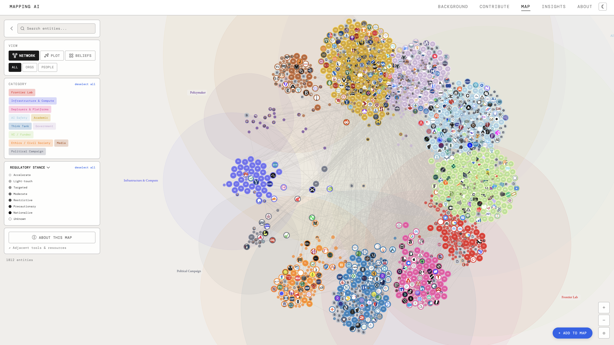

_Note: Existing screenshot works as hero._

### Tweet 2 [~240/280]

The Network view shows who's connected to whom.

Click any node to see their relationships light up. Filter by category to focus on specific communities.

Here's @timnitGebru's network.

`[ATTACH: map-network-selected.png]`

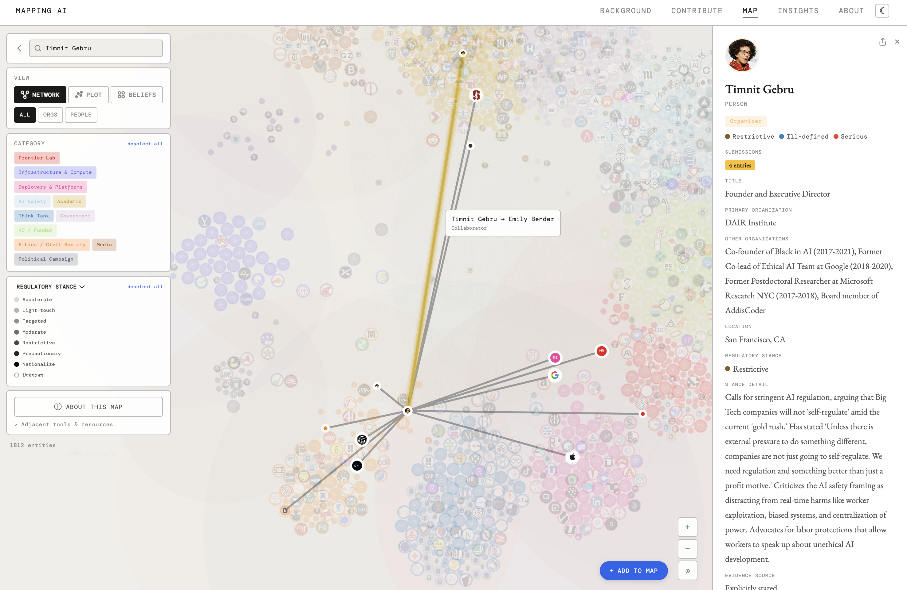

_Note: Network with a node selected showing connections._

### Tweet 3 [~230/280]

The Plot view lets you compare beliefs.

X-axis: regulatory stance (accelerate → precautionary)
Y-axis: AGI timeline (never → <2 years)

Outliers tell a story. @JensenHuang and @leopoldasch occupy opposite corners.

`[ATTACH: map-plot.png]`

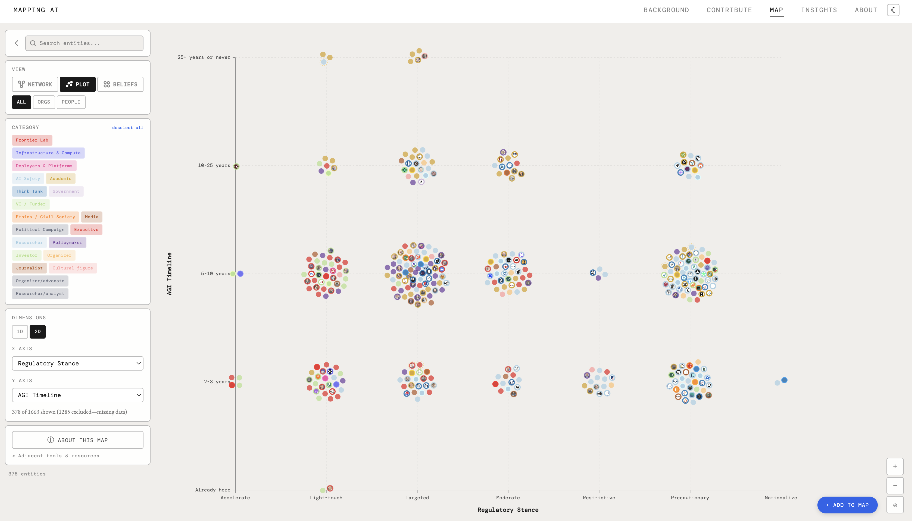

_Note: Existing screenshot works._

### Tweet 4 [~220/280]

The Beliefs view clusters people by how they define AGI.

66 entities say "human-level cognitive parity." 42 reject the framing entirely. 38 define it as superintelligence.

Same term, completely different meanings.

`[ATTACH: map-beliefs-view.png]`

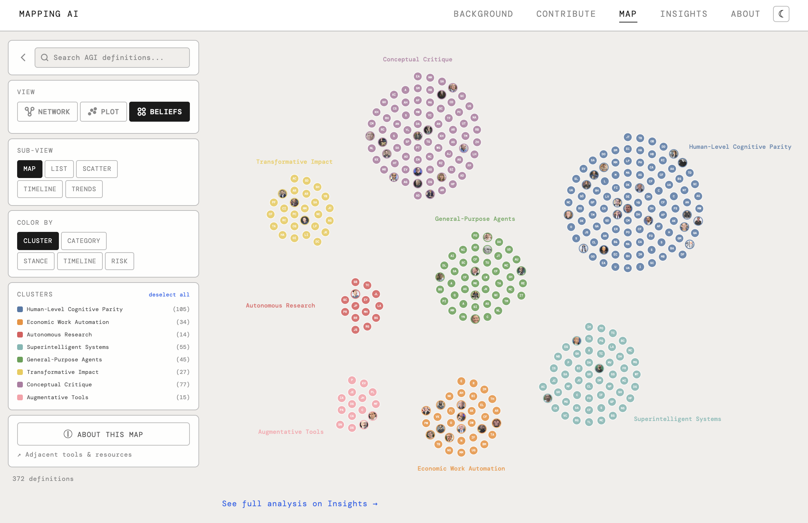

_Note: Existing screenshot works._

### Tweet 5 [~200/280]

The Insights page digs deeper.

Funding flows. Policy stances by party. Who bridges communities. All backed by sourced claims.

`[ATTACH: insights-overview.png]`

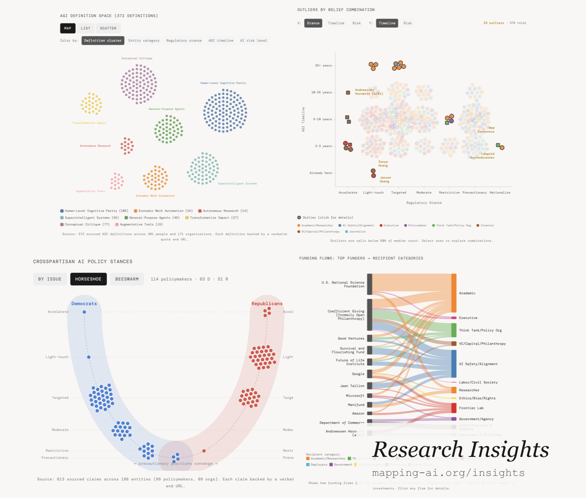

_Note: Collage of 4 key insights charts with "Research Insights" overlay._

### Tweet 6 [~230/280]

This is crowdsourced and open.

Anyone can submit a person, org, or resource. We review submissions and link them into the network.

Know someone missing? Add them.

`[ATTACH: contribute-form.png]`

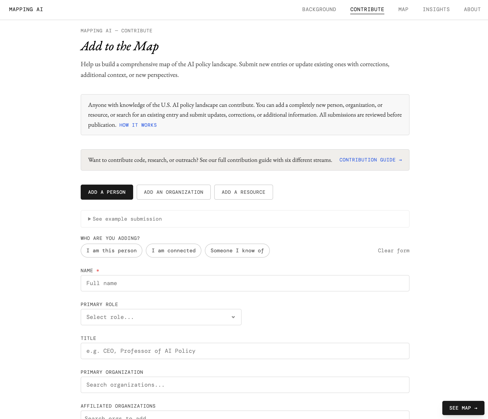

_Note: Screenshot of contribute form._

### Tweet 7 [~250/280]

We're not the only ones mapping this space.

Shoutout to @techieray @WillRinehart @ReadTransformer @DanielColson6 for building transparency tools we admire.

We're adding relationships + belief data to the picture.

*Note: Credits adjacent tool builders for credibility and potential RTs.*

### Tweet 8 [~210/280]

Every belief claim is backed by a verbatim quote and source.

Explore the full map:
mapping-ai.org/map

Read the analysis:
mapping-ai.org/insights

Contribute:
mapping-ai.org/contribute

_Note: No image needed for final CTA._

---

## Thread 1: The AGI Definition Problem

**Angle:** Everyone says "AGI is coming" but they all mean different things. We mapped 240 definitions.

### Tweet 1 [210/280 - OK]

Everyone keeps saying "AGI is coming."

But when you actually map what people mean by AGI, you find completely different definitions.

We built a tool to visualize this. Here's what the data shows:

`[ATTACH: insights-agi-defs.png]`

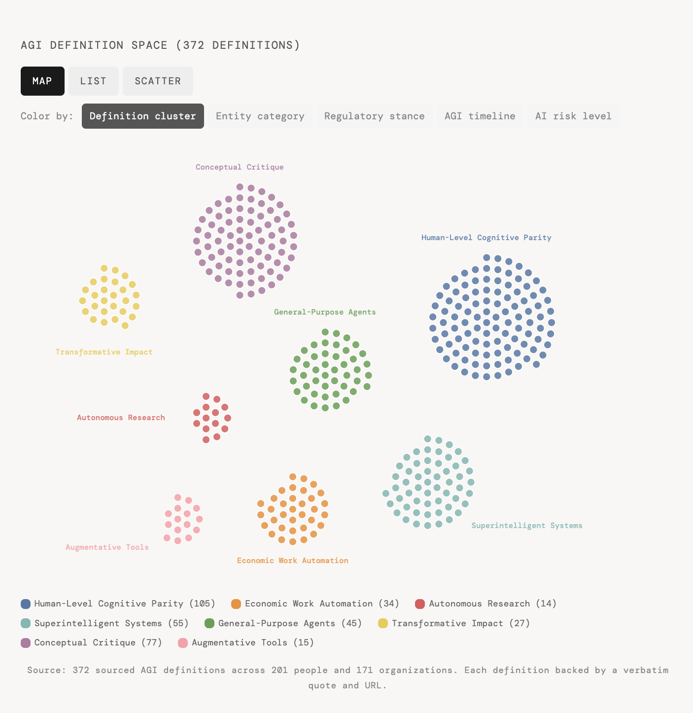

_Note: Hook tweet. Image: UMAP cluster visualization._

### Tweet 2 [231/280 - OK]

The largest cluster (66 entities): AGI = human-level cognitive parity.
@AndrewYNg, @geoffreyhinton, @GaryMarcus, @GoogleDeepMind, and @pmarca all land here.

But even within this group, "human-level" can mean very different things.

_Note: Name-drops for engagement. These people may RT or quote-tweet._

### Tweet 3 [237/280 - OK]

The second biggest cluster (42 entities): people who reject the framing entirely.

@drfeifei, @emilymbender, @mer\_\_edith, @HelenToner, @MistralAI, and @raborjhoffman all say AGI is the wrong question. We classify this as a conceptual critique.

### Tweet 4 [252/280 - OK]

Then there's the "superintelligence" cluster (38 entities).
@DarioAmodei, @AnthropicAI, @BillGates, @paulfchristiano all define AGI as AI that surpasses humans, with recursive self-improvement. They have similar timeline debates but a fundamentally different endpoint.

### Tweet 5 [268/280 - OK]

Color the same map by regulatory stance and a pattern emerges: more people who define AGI as "superintelligence" and "human-level cognitive parity" want precautionary regulation over light-touch rules.

Definitions correlate with policy stance.

`[ATTACH: map-beliefs-stance.png]`

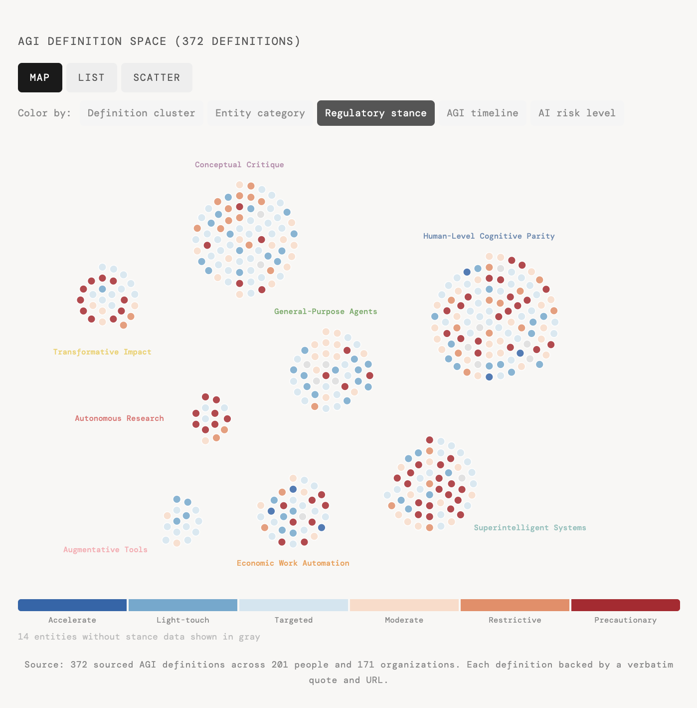

_Note: Key insight tweet stance-colored UMAP_

### Tweet 6 [221/280 - OK]

So when @JensenHuang says "AGI is already here" and @leopoldasch says "2-3 years away," they aren't just disagreeing on timing—they're talking about completely different things.

Explore the full map: mapping-ai.org/map

`[ATTACH: insights-outliers-2d-bottom.png]`

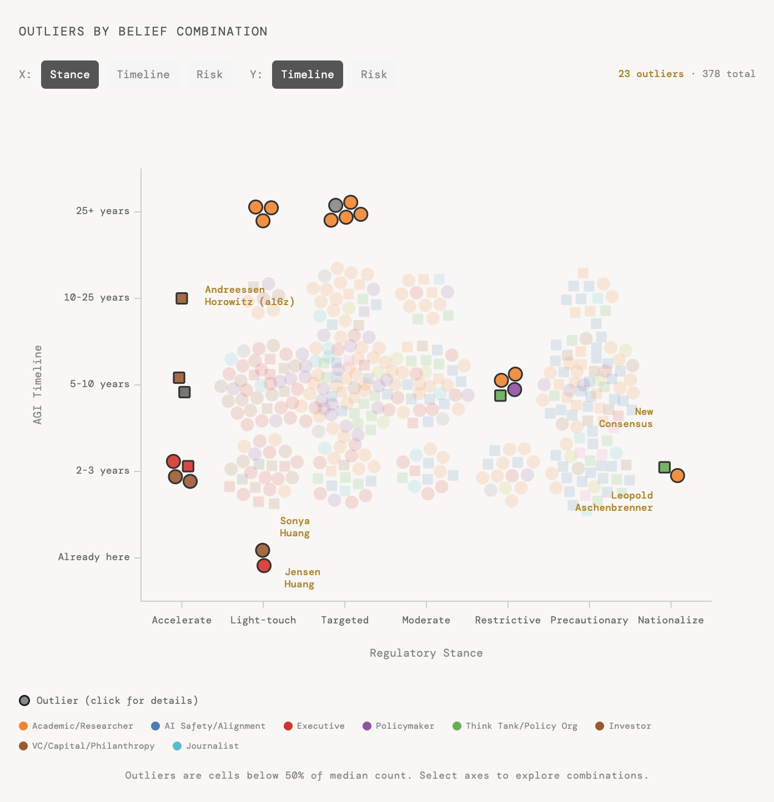

_Note: Close with the outlier chart showing Jensen + Leopold. CTA to the site._

### Tweet 7 [162/280 - OK]

We mapped 1,812 entities across 745 people, 918 organizations, and 2,925 relationships in the U.S. AI policy landscape.

It's all open source. Check it out here:

mapping-ai.org

`[ATTACH: map-network-clean-controls.png]`

_Note: Final CTA tweet with the network visualization._

---

## Thread 2-ALT: Follow the Money (Insight-Led)

**Angle:** Funding source predicts regulatory stance. We linked attributes no one else tracks together.

### Tweet 1 [261/280 - OK]

We tracked 1,176 funding relationships across the AI policy ecosystem.

The pattern: where the money comes from predicts what an org believes about regulation.

VC-funded orgs avg 2.5 (light-touch). Philanthropic: 4.7 (precautionary). The gap is enormous.

`[ATTACH: insights-funding-stance.png]`

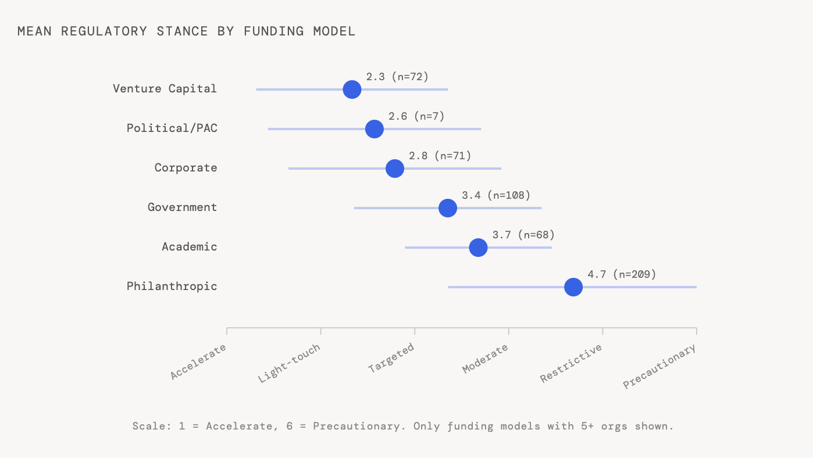

_Note: Setup + punchline in one tweet. Dot plot showing funding model vs stance._

### Tweet 2 [280/280 - OK]

The top 5 funders reach 58% of all policy organizations.

@OpenPhil / Coefficient Giving: 26 orgs
Survival & Flourishing Fund: 13
@FLI_org: 10
Jaan Tallinn: 10
Good Ventures: 9

This totals 68 connections to 117 policy orgs.

`[ATTACH: insights-kingmakers.png]`

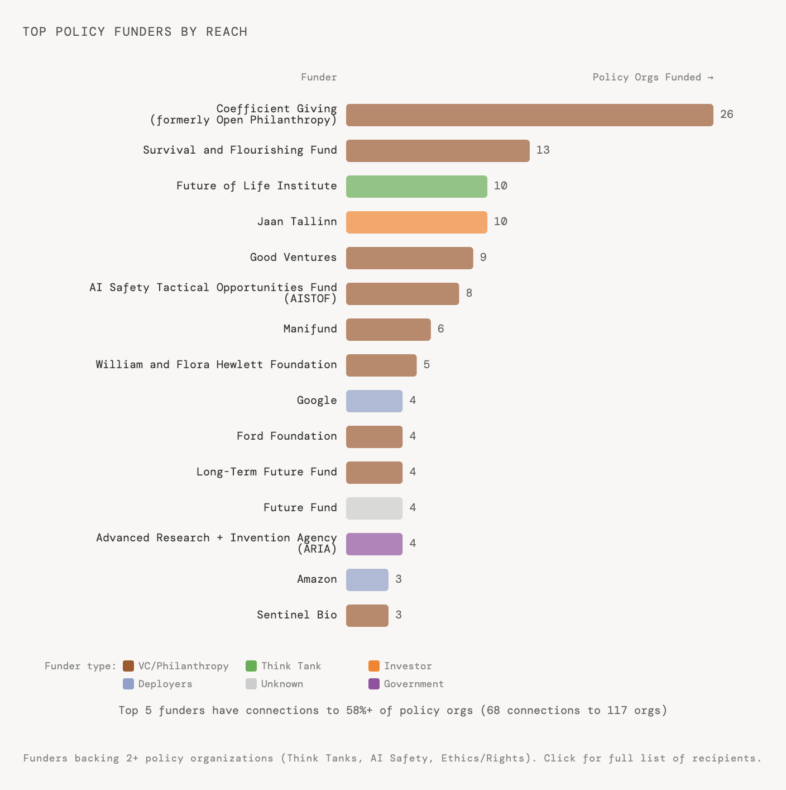

_Note: Kingmakers chart. Power-law concentration._

### Tweet 3 [201/280 - OK]

We track concentration risk. How much of an org's funding comes from a single source?

43% of policy orgs get 40%+ from a single source. Others spread across 7+ funder types.

Does money shape the message?

`[ATTACH: insights-fragility.png]`

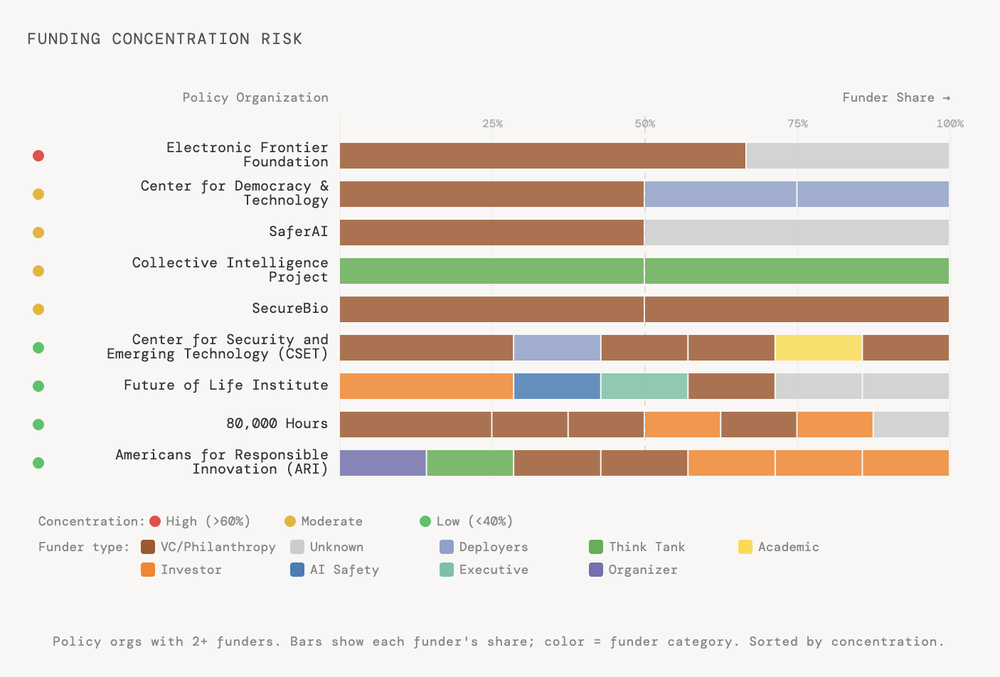

_Note: FundingFragility chart with concentration risk indicators._

### Tweet 4 [246/280 - OK]

Philanthropic money flows to AI Safety orgs and Think Tanks.

Tech company money (@Google, @Microsoft, @Amazon) flows to Frontier Labs and Infrastructure.

@a16z funds Deployers & Platforms almost exclusively.

`[ATTACH: insights-funding-sankey.png]`

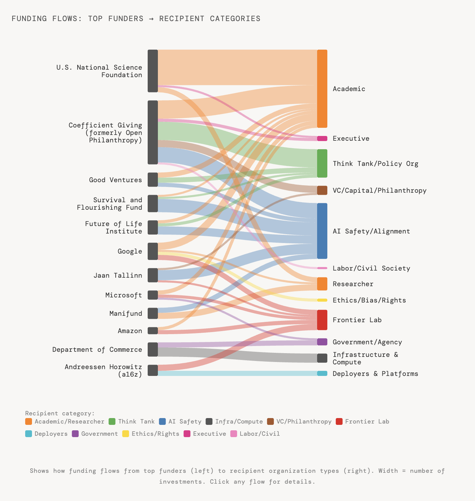

_Note: Sankey with interpretation. Supporting detail, not the hook._

### Tweet 5 [248/280 - OK]

This doesn't mean funders are buying positions. They may simply select for orgs that already agree. But structurally, it means the AI policy conversation is shaped by a small number of capital sources.

Explore the full analysis: mapping-ai.org/insights

_Note: Hedge causation. CTA._

---

## Thread 3: The Outlier Chart

**Angle:** Map everyone on their AI regulation stance vs AGI timeline belief. Story on outliers.

### Tweet 1 [142/280 - OK]

We plotted 378 AI leaders on two axes:

X: How much regulation do they want?
Y: When do they think AGI arrives?

Some striking outliers emerge.

`[ATTACH: insights-outliers-2d-bottom.png]`

_Note: The 2D outlier chart with labeled names. The main viral image._

### Tweet 2 [222/280 - OK]

@JensenHuang: AGI is "already here" + light-touch regulation.

@leopoldasch: AGI in 2-3 years + nationalize AI.

Same urgency, different definitions, opposite policy conclusions. They occupy completely different corners of the belief space.

### Tweet 3 [233/280 - OK]

@a16z: AGI in 10-25 years + light-touch regulation.
@SoftBank: AGI in 5-10 years + light-touch.
@sonyahuang: AGI "already here" + light-touch.

The investor cluster sits firmly in the bottom-left: short timelines, minimal regulation.

_Note: Investor cluster callout. Tag the orgs._

### Tweet 4 [223/280 - OK]

Most of the ecosystem clusters in the middle: targeted-to-moderate regulation, 2-10 year AGI timelines. The outliers are rare belief combinations that put you in a cell with very few peers.

Where would you place yourself?

_Note: Engagement question at the end._

### Tweet 5 [158/280 - OK]

Explore the interactive version. Click any dot to see the full profile.

mapping-ai.org/map (switch to Plot view)
mapping-ai.org/insights (scroll to Outliers)

`[ATTACH: map-plot.png]`

_Note: CTA with the interactive Plot view._

---

## Thread 4: The Horseshoe

**Angle:** Left and right agree more on AI policy than you think. The data shows a horseshoe.

### Tweet 1 [228/280 - OK]

We sourced 613 claims from 141 policymakers across 6 AI policy issues.

When you map Democrats and Republicans on a regulatory spectrum, the result is a horseshoe.

The precautionary wings of both parties converge at the bottom.

`[ATTACH: insights-horseshoe.png]`

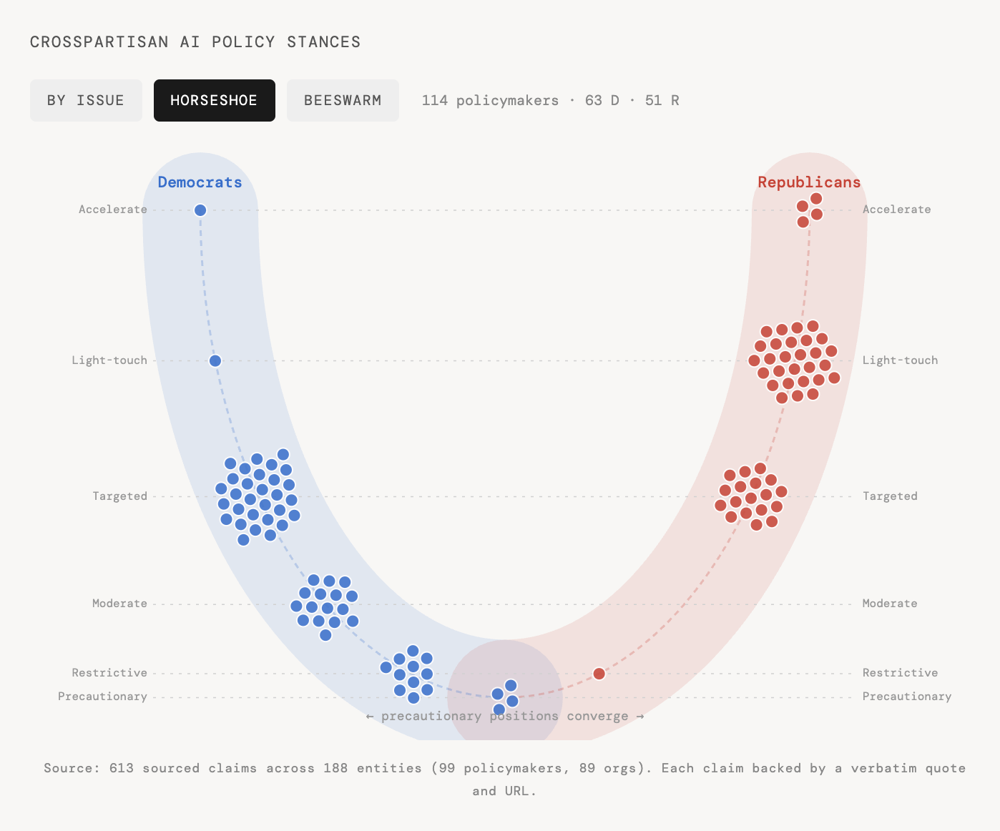

_Note: The horseshoe viz is the hero image. Extremely shareable._

### Tweet 2 [258/280 - OK]

On federal preemption of state AI laws: bipartisan split. Some Democrats and Republicans want federal control, others want state flexibility.

On open-weight model restrictions: similar spread on both sides.

The left-right frame misses the real fault lines.

`[ATTACH: insights-crosspartisan.png]`

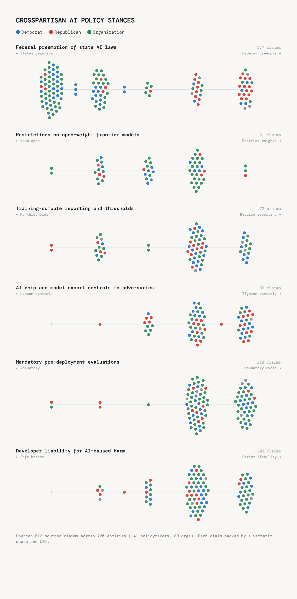

_Note: By-issue beeswarms showing bipartisan spread._

### Tweet 3 [214/280 - OK]

The real divide in AI policy is acc vs. precautionary. And that axis cuts across party lines.

### Tweet 4 [176/280 - OK]

Every claim in our database is backed by a verbatim quote and URL.

Explore the full crosspartisan analysis with sourced claims:
mapping-ai.org/insights

_Note: Credibility + CTA._

---

## Thread 5: Bridge Builders

**Angle:** Who actually connects the AI policy ecosystem? Network analysis reveals the bridge builders.

### Tweet 1 [220/280 - OK]

We built a network graph of 1,812 entities in U.S. AI policy and measured who can reach the most people within 3 hops.

Here's who we found connecting communities that would otherwise be siloed:

`[ATTACH: insights-bridge-builders.png]`

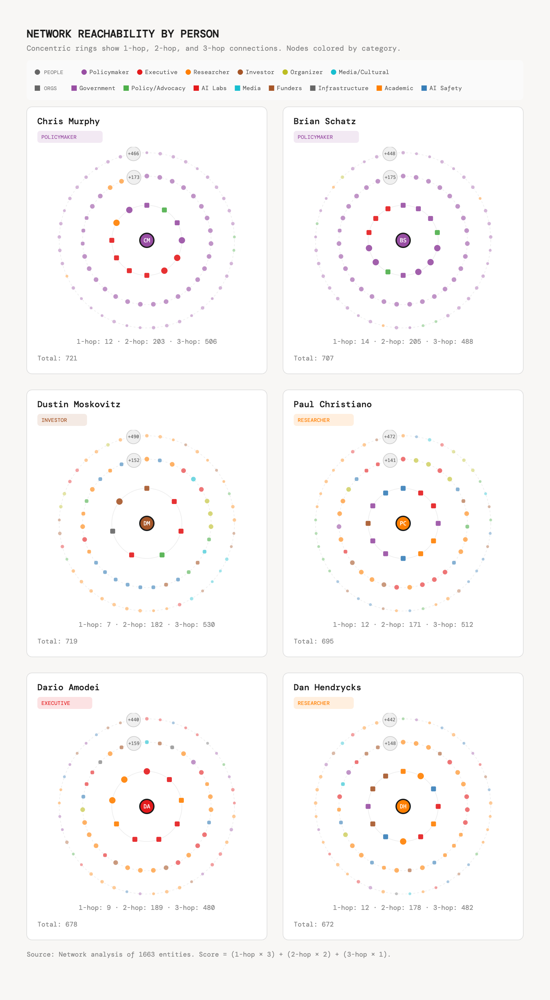

_Note: Bridge builder cards with concentric ring visualizations._

### Tweet 2 [248/280 - OK]

@brianschatz reaches 532 entities
@ChrisMurphyCT: 529
@paulfchristiano: 481
@DarioAmodei: 476
@GavinNewsom: 463
@CoryBooker: 422

(These numbers depend on which relationships we've captured publicly. Not a complete census.)

_Note: Names with reach counts. No ordinals. Caveat about data completeness._

### Tweet 3 [254/280 - OK]

Policymakers appear often because their government roles connect them to many organizations by default.

Notably, @paulfchristiano: a researcher bridging AI Safety, Frontier Labs, and Government.

High reachability = structural position for coalition-building.

`[ATTACH: insights-bridge-builders-2.png]`

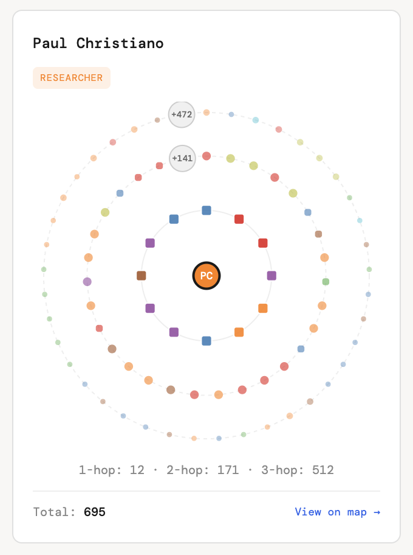

_Note: Christiano and Amodei cards showing their diverse connections._

### Tweet 4 [174/280 - OK]

The full interactive network map lets you click any person or org to see their connections light up.

mapping-ai.org/map

1,812 entities. 2,925 relationships. All explorable.

`[ATTACH: map-network-clean.png]`

_Note: CTA with the full network graph._
