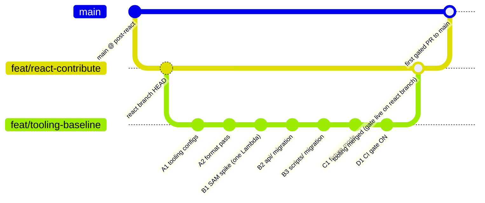

# React Tooling Baseline (pre-merge on feat/react-contribute)

## Overview

Land a comprehensive lint/format/typecheck/test gate on the `feat/react-contribute` branch **before** it merges to `main`, so that the React merge PR is itself the first PR that passes the gate. Simultaneously migrate `api/`, `scripts/`, `dev-server.js`, and `src/tiptap-notes.js` to TypeScript so "end-to-end type safety" actually means end-to-end, and add a fixture mode so a public forker can clone the repo and see a working app without any credentials.

This work is scoped and shaped by `docs/brainstorms/2026-04-17-react-tooling-baseline-requirements.md` (R1–R10). No product decisions are re-opened here.

## Problem Frame

Today, on `feat/react-contribute`:

- TypeScript `strict` is on, but `tsconfig.json` **excludes** `api/` and `scripts/`. The `toFrontendShape()` mapping between DB columns and frontend field names — the single most common source of silent breakage — is unchecked on the backend side of the wire.
- There is **zero** enforcement tooling. No ESLint, no Prettier, no pre-commit hook, no CI PR check. The only CI job (`.github/workflows/deploy.yml`) triggers on push to `main` and never runs `tsc`, `vitest`, or a linter.
- A public forker cannot run the app. `dev-server.js` requires `DATABASE_URL` to boot; `contribute.html` requires `ANTHROPIC_API_KEY` for search; `ONBOARDING.md` still documents `node dev-server.js` rather than the Vite workflow.
- The SAM deploy incident on 2026-04-16 (`docs/solutions/integration-issues/sam-deploy-overwrites-manual-cloudfront-config-2026-04-16.md`) established that every `template.yaml` change is a potential production outage. Wiring SAM's esbuild build into `template.yaml` is unavoidable to ship typed Lambdas, so it must be done with dry-run discipline.

If we merge `feat/react-contribute` to `main` without landing this baseline first, the merge itself skips the gate, and the first gated PR will be a huge backlog cleanup. Doing it in the branch is the cheaper order.

## Requirements Trace

All requirements come from the origin document.

- **R1.** Whole-repo TypeScript — migrate `api/*.js`, active `scripts/*.js`, `dev-server.js`, `src/tiptap-notes.js`.
- **R2.** ESLint 9 (flat config) + Prettier, covering `src/`, `api/`, `scripts/`, config files.
- **R3.** Light pre-commit hook (format-only on staged files) + strict CI on every PR (format-check, lint, `tsc --noEmit`, tests, build).
- **R4.** SAM `Metadata: BuildMethod: esbuild` on every Lambda so `sam build` compiles `.ts` → `.js` at deploy time.
- **R5.** `npm run dev` in a fresh clone (no `.env`) must render the full map + forms via fixture mode.
- **R6.** Sanitized fixture generator script that pulls from the live DB and strips PII by allowlist.
- **R7.** `README.md`, `ONBOARDING.md`, `.env.example` all reflect the new flow.
- **R8.** `.editorconfig`, `.nvmrc`, `.vscode/settings.json` + `.vscode/extensions.json` for editor parity.
- **R9.** Dependabot weekly grouped updates for npm + GitHub Actions.
- **R10.** All of the above lands on `feat/react-contribute` **before** it merges to `main`. The React merge PR is the first gated PR.

## Scope Boundaries

- No Biome / Oxc — ESLint 9 + Prettier is locked (origin Key Decisions).
- No migration of inline `map.html` to React — MPA + D3 inline stays (see origin Scope Boundaries and `docs/solutions/integration-issues/vite-react-typescript-migration-from-inline-html-2026-04-15.md`).
- No Playwright / Puppeteer in CI. Vitest + Testing Library + `vite build` + `sam validate` is the gate.
- No docker-compose — fixture mode only.
- Not migrating **every** file in `scripts/`. Active scripts get typed; ~40 enrichment one-offs move to `scripts/archive/` and are excluded from the TS/lint scope.
- Not touching `.env` storage, secret management, or `AnthropicSemanticSearchKey` rotation.
- No CODEOWNERS / PR templates / commitlint in this plan — good follow-ups but scope creep here.

## Context & Research

### Relevant Code and Patterns

- **Vite MPA pattern** — `vite.config.ts` (Rollup input map), `appType: 'mpa'`. Established by the React migration; do not change shape in this plan.
- **Typed frontend contract already exists** — `src/types/entity.ts` mirrors `toFrontendShape()`. The shared-types module is a `mv` + re-wire away, not a net-new abstraction.
- **Existing esbuild invocation** — `scripts/build:tiptap` uses bare esbuild for the TipTap bundle. SAM esbuild build reuses the same tool chain — no new build concept for the team.
- **Lambda handler signature** — all 7 handlers (`api/{submit,search,semantic-search,admin,upload,submissions}.js` + `cors.js` helper) follow the API Gateway v2 HTTP API shape. `@types/aws-lambda`'s `APIGatewayProxyHandlerV2` is the right type.
- **`test-handlers.mjs`** at the repo root is an existing local test runner for Lambdas — keep it (out of CI by policy), but typing the handlers makes it higher-value.
- **`scripts/migrate.js`, `seed.js`, `export-map-data.js`, `backup-db.js`** are the hot-path scripts — referenced in `package.json` and CI. These are the must-migrate scripts. Enrichment scripts (`enrich-*.js`, `seed-*.js` series, `dedupe-*.js`, `analyze-*.js`) are historical one-offs and move to an archive directory.

### Institutional Learnings

- **`docs/solutions/integration-issues/vite-react-typescript-migration-from-inline-html-2026-04-15.md`** — "Spike before restructuring" pattern. Apply directly: before renaming 7 Lambdas, do a one-Lambda SAM esbuild spike and confirm `sam deploy --no-execute-changeset` produces a changeset limited to Function resources. Also codifies the Vite MPA coexistence contract — do not alter.
- **`docs/solutions/integration-issues/sam-deploy-overwrites-manual-cloudfront-config-2026-04-16.md`** — Every `template.yaml` change is load-bearing. MUST use `--no-execute-changeset` dry runs and read the full changeset before applying. The Metadata block change is low-risk in theory but high-risk in this template given the incident history.
- **`CLAUDE.md` "DB Safety"** — run `npm run db:backup` before any risky admin work. The fixture generator script (Unit 8) queries the live DB; a backup precedes its first real run.
- **Auto-memory `feedback_sam_deploy_danger.md`** — reinforces: never run `sam deploy` without a drift check.
- **Auto-memory `feedback_no_defer_d3.md`** — untouched here (we don't touch `map.html`'s D3 loading).

### External References

- **typescript-eslint flat config (context7 `/typescript-eslint/typescript-eslint`)** — `tseslint.configs.recommendedTypeChecked` + `stylisticTypeChecked` + `parserOptions: { projectService: true }` is the 2026 pattern. `disableTypeChecked` override for `.js` files remains essential during any incremental phase. Vite scaffolds a working flat config; start from that shape.
- **AWS SAM `BuildMethod: esbuild`** — `Metadata` block sits alongside `Properties` on each `AWS::Serverless::Function` (not supported inside `Globals.Function`). `BuildProperties` covers `Minify`, `Target`, `Sourcemap`, `EntryPoints`, `External`. `Handler` stays as `api/admin.handler`; SAM rewrites the bundle path transparently.
- **Lefthook vs Husky (2026 state)** — Lefthook is a single Go binary configured via `lefthook.yml`, no Node post-install step, and plays well with public forks (contributors run `npx lefthook install` once). Husky requires a Node dependency and a `prepare` script. For a public-facing repo optimizing for low friction, Lefthook wins.

## Key Technical Decisions

- **Spike the SAM esbuild change on one Lambda first.** The `submissions` handler is the simplest (`api/submissions.js`, GET-only, no secrets). Convert it, add Metadata, dry-run `sam deploy --no-execute-changeset`, confirm the changeset is scoped to Function updates only. Only then migrate the remaining 6. Rationale: matches the Vite MPA spike pattern that saved the React migration; directly mitigates the 2026-04-16 incident class.
- **Shared types live at `src/shared/`**, not in a new top-level `shared/`. `src/shared/export-map.ts` hosts the typed `toFrontendShape()` and the belief-score tables. Backend Lambdas import relatively (`../src/shared/...`). Rationale: keeps the TS path mapping simple, avoids inventing a new top-level folder just for two files, and `tsconfig.json` can broaden its `include` naturally.
- **Lefthook over Husky** for the pre-commit layer. Rationale: single binary, no `prepare` script, friendlier for first-time contributors, works identically in fresh clones.
- **`tsx` for running TS scripts directly** (not compiling them through Vite or esbuild first). Rationale: `npm run db:migrate` should still be one command; `tsx scripts/migrate.ts` is equivalent to `node scripts/migrate.js` but typed. No build artifacts in `scripts/`.
- **`concurrently` for `npm run dev`** spins up Vite + dev-server in one process. Rationale: R5 requires a single-command start for forks; rolling a bespoke launcher adds maintenance with no upside.
- **Fixture output ships in git**, not just the generator. Rationale: R5 (fresh clone → working app) only works if the fixture file exists on first clone. The generator is maintainer-only. `fixtures/map-data.json` is tracked; the generator is `scripts/generate-fixtures.ts` (requires DB) and is run manually by the maintainer before tagged public releases.
- **Format-first commit is isolated.** Running `prettier --write .` across the repo will touch nearly every file. Keep that change in its own commit (or sub-PR) with no rule changes — so `git blame` on behavior changes isn't destroyed by formatting noise.
- **Type-aware ESLint rules only on the typed surface.** `tseslint.configs.recommendedTypeChecked` is expensive and needs `projectService`. Restrict to `src/**/*.{ts,tsx}`, `api/**/*.ts`, `scripts/**/*.ts`; config files and archive scripts fall under `disableTypeChecked`. Rationale: keeps CI under ~60s and avoids parsing the ~40 archived enrichment scripts.

## Open Questions

### Resolved During Planning

- **lefthook vs Husky?** → Lefthook. See Key Technical Decisions.
- **Where do shared types live?** → `src/shared/`. See Key Technical Decisions.
- **Where does the fixture JSON live in-repo?** → `fixtures/` at repo root. Tracked in git. Generator under `scripts/`.
- **Which scripts migrate vs archive?** → Active (referenced by `package.json` or CI): `migrate`, `seed`, `seed-test-data`, `backup-db`, `export-map-data`, `export`, `verify-integrity`, `generate-contributor-key`, `revoke-contributor-key`, `enrich-people`, `enrich-elections`. Everything else moves to `scripts/archive/` and is excluded from TS/ESLint includes.
- **Keep `External: [pg, @anthropic-ai/sdk]` in SAM esbuild config?** → Yes. `pg` has native binaries; `@anthropic-ai/sdk` works as bundled but is large. Listing both as External keeps bundles small and avoids native-binary issues. Dependencies stay in `package.json` so SAM installs them at build time.
- **Sourcemap for Lambda bundles?** → No (`Sourcemap: false`) at this stack size. Revisit only if production stack-trace diagnostics become painful.
- **Allowlist or denylist for fixture sanitization?** → Denylist-first. The plan's original allowlist framing was too permissive for a public-commit artifact. Unit 8 explicitly drops all free-text fields and sample-size fields, and explicitly excludes the `contributor_keys` table.
- **Should `notes_html` be mention-stripped or dropped?** → Dropped. Stripping mentions leaves surrounding prose that can still identify internal entities (deepening review finding).
- **Which `submission` fields land in the fixture?** → None. The `submission` and `contributor_keys` tables are never read by the fixture generator. Only `entity` (approved) and `edge` (both endpoints approved) are considered.

### Deferred to Implementation

- **Exact ESLint rule diff when enforcement turns on.** Planning-time enumeration is speculative — many rules will flag things we don't know about until `eslint .` actually runs. Unit 15 absorbs the cleanup.
- **Whether `tsc --noEmit` passes cleanly after migrating `api/`.** Some Lambdas use dynamic `require()` patterns and loose argument access. Expect a handful of `noUncheckedIndexedAccess` flags; address during Unit 4. If a specific call needs a structural refactor, surface as a follow-up rather than bundling here.
- **Whether `concurrently` needs a separate restart signal handler** for dev-server + Vite, or if SIGINT propagation is clean. Validate during Unit 10.
- **What the internal-names.txt file contains in practice.** Unit 8's n-gram check needs a real list seeded by the maintainer at first fixture run. Enumeration is maintainer-only work (not agent-planning-time work).

## High-Level Technical Design

> _This illustrates the intended approach and is directional guidance for review, not implementation specification. The implementing agent should treat it as context, not code to reproduce._

### Branch strategy



### eslint.config.js shape (directional)

```
export default [
  globalIgnores(dist, node_modules, .aws-sam, scripts/archive, assets/js/tiptap-notes.js)
  js.recommended
  tseslint.recommendedTypeChecked + stylisticTypeChecked
    languageOptions.parserOptions.projectService: true
    scoped to: src/**/*.{ts,tsx}, api/**/*.ts, scripts/**/*.ts (active)
  react-hooks.recommended-latest   // React 19 compatible
  jsx-a11y.recommended             // src/**/*.{tsx}
  import/typescript + import/recommended
  vitest-plugin.recommended         // src/__tests__/**
  tseslint.disableTypeChecked on: **/*.js, **/*.cjs, eslint.config.js, vite.config.ts-out-of-project
  prettier (last — disables stylistic rules that fight Prettier)
]
```

### SAM per-function Metadata (directional)

```
SubmitFunction:
  Type: AWS::Serverless::Function
  Metadata:
    BuildMethod: esbuild
    BuildProperties:
      Minify: true
      Target: es2020
      Sourcemap: false
      EntryPoints: [api/submit.ts]
      External: [pg, @anthropic-ai/sdk]
  Properties:
    Handler: api/submit.handler
    # ... (unchanged)
```

Global note: `Metadata` is NOT supported inside `Globals.Function` per SAM Globals docs — must be repeated per function (or generated via a small CloudFormation macro, which we explicitly don't introduce here).

### Dev-server fixture mode (directional)

```
dev-server.ts startup:
  if (!DATABASE_URL) {
    loadFixtures('fixtures/*.json') → in-memory
    logBanner('FIXTURE MODE: no DB. Submissions log to console.')
    register fixture-backed handlers for /submissions, /search, /semantic-search, /admin GET
    register stub handlers for POST /submit, POST /admin (log + return mock ok)
    return app.listen(...)
  }
  // else: existing DB-backed path
```

## Implementation Units

Organized into five phases that map to the branch strategy diagram. Each phase ends in a pushable commit that keeps the branch buildable.

### Phase A — Tooling scaffolding (no enforcement yet)

- [ ] **Unit 1: Install deps and add config files**

**Goal:** Get ESLint, Prettier, Lefthook, EditorConfig, and Node version pin into the repo without turning on enforcement anywhere.

**Requirements:** R2, R3, R8

**Dependencies:** None.

**Files:**

- Create: `eslint.config.js`
- Create: `.prettierrc.json`, `.prettierignore`
- Create: `.editorconfig`
- Create: `.nvmrc` (pin to `20`)
- Create: `.vscode/settings.json`, `.vscode/extensions.json`
- Create: `lefthook.yml`
- Modify: `package.json` (add devDependencies: `eslint@^9`, `typescript-eslint@^8`, `@eslint/js`, `eslint-plugin-react-hooks`, `eslint-plugin-jsx-a11y`, `eslint-plugin-import`, `eslint-import-resolver-typescript`, `eslint-config-prettier`, `prettier@^3`, `lefthook`, `tsx`, `concurrently`; add scripts: `lint`, `lint:fix`, `format`, `format:check`, `type-check`)
- Test: none (config-only unit)

**Approach:**

- Follow the flat-config shape in the High-Level Technical Design. Enforcement is on for `src/` only at this unit; `api/` and `scripts/` are covered by `tseslint.configs.disableTypeChecked` until they're typed in Phase B.
- `.prettierignore` mirrors `.gitignore` plus `dist/`, `.aws-sam/`, `assets/js/tiptap-notes.js`, `map-data.json`, `map-detail.json`, `fixtures/`.
- `lefthook.yml` wires only the `pre-commit` step (format + lint-fix on staged). No `pre-push` yet.
- `.vscode/extensions.json` recommends `dbaeumer.vscode-eslint`, `esbenp.prettier-vscode`, `bradlc.vscode-tailwindcss`.
- No package-lock change should touch existing deps — only additive.

**Patterns to follow:**

- Vite's scaffolded React+TS ESLint flat-config template (if needed, align to current typescript-eslint v8 idioms shown in context7 docs).

**Test scenarios:**

- _Happy path:_ `npx eslint src/ --max-warnings=0` exits 0 (after any pre-existing issues are addressed — if count is non-zero at the end of this unit, record the count; Unit 15 resolves).
- _Happy path:_ `npx prettier --check .` succeeds after Unit 2.
- _Integration:_ `npx lefthook install && echo "test" > /tmp/_x.ts && git add /tmp/_x.ts` triggers the hook in a scratch commit.

**Verification:** Running `npm run lint`, `npm run format:check`, `npm run type-check` locally all succeed (or fail with a known, enumerated list the next units will close).

- [ ] **Unit 2: One-shot `prettier --write .` commit**

**Goal:** Normalize formatting across the repo in a single behavior-free commit so future `git blame` stays useful.

**Requirements:** R2

**Dependencies:** Unit 1.

**Files:**

- Modify: likely most files under `src/`, `api/`, `scripts/`, `*.md`, `*.yaml`, `*.json`.

**Approach:**

- Run `npx prettier --write .` once. Review the diff at a directory-summary level (line counts per directory) rather than line-by-line — the whole point is that it's mechanical.
- Keep this as its own commit, clearly titled (e.g. `style: prettier --write .`), reviewed by eyeballing only that no non-whitespace content changed.

**Test scenarios:**

- _Integration:_ `npm run build` (Vite) still produces an identical `dist/` shape.
- _Integration:_ `npm test` still passes (Vitest).

**Verification:** `npx prettier --check .` returns 0 afterwards.

### Phase B — TypeScript migration (backend)

- [ ] **Unit 3: Stabilize shared types module**

**Goal:** Produce `src/shared/export-map.ts` that exports a typed `toFrontendShape(row: DbEntityRow): FrontendEntity` and the ordinal score tables. Frontend and backend import from the same typed module.

**Requirements:** R1

**Dependencies:** Unit 1 (so TS path mapping is in place).

**Files:**

- Create: `src/shared/export-map.ts` (typed port of `api/export-map.js`)
- Create: `src/shared/db-types.ts` (new `DbEntityRow`, `DbSubmissionRow`, `DbEdgeRow` matching `scripts/migrate.js` schema)
- Modify: `src/types/entity.ts` (re-export from `src/shared/` where useful)
- Modify: `tsconfig.json` (broaden `include` to `src`, keep `exclude` on `dist`, `node_modules`, `scripts/archive`)
- Test: `src/__tests__/shared/export-map.test.ts`

**Approach:**

- Port the existing allowlist from `api/export-map.js` one-for-one. No behavior changes.
- `DbEntityRow` has every column from `CREATE TABLE entity` in `scripts/migrate.js` (including all `belief_*_wavg/wvar/n`). `FrontendEntity` is the existing `Entity` interface.
- Keep `api/export-map.ts` as a thin ESM re-export wrapper during Phase B so current Lambdas don't break mid-migration: `export * from '../src/shared/export-map.js'`. Note the `.js` extension in the import path — that's the TS-ESM canonical form, and `"type": "module"` + the Lambda runtime both require it. Alternatively land this unit alongside Unit 4 as a single commit and skip the wrapper entirely.

**Test scenarios:**

- _Happy path:_ Given a row with all belief columns populated, `toFrontendShape` returns the same JSON as the current `api/export-map.js` does (snapshot-compare against a seeded DB row captured once).
- _Edge case:_ `entity_type: 'resource'` correctly maps `resource_title → title` and `resource_url → url`.
- _Edge case:_ Null `belief_*_wavg` falls through to the text-label ordinal score.

**Verification:** `npm test` passes; `npm run type-check` produces zero errors from `src/shared/**`.

- [ ] **Unit 3.5: CloudFormation stack drift detection (read-only precursor)** ⚠️

**Goal:** Confirm the deployed stack matches `template.yaml` before any SAM-touching change. The 2026-04-16 post-mortem's Prevention #4 specifically calls for this step, and skipping it risks misreading Unit 4's changeset (a pre-existing drift would surface as a "correction" that looks like esbuild fallout).

**Requirements:** R4

**Dependencies:** None technical; run any time before Unit 4.

**Execution note:** Read-only CLI. No resources modified.

**Files:**

- Modify: `docs/DEPLOYMENT.md` (add drift-check to the pre-deploy checklist)

**Approach:**

1. `aws cloudformation detect-stack-drift --stack-name mapping-ai` (async; returns a drift detection ID).
2. Poll with `aws cloudformation describe-stack-drift-detection-status --stack-drift-detection-id <id>` until `DRIFT_DETECTION_COMPLETE`.
3. `aws cloudformation describe-stack-resource-drifts --stack-name mapping-ai --stack-resource-drift-status-filters MODIFIED DELETED`.
4. If any drift found: codify the drifted property into `template.yaml` first, deploy that as its own changeset (separately reviewed), then start Unit 4 fresh.
5. If no drift found: record the date of the clean scan in DEPLOYMENT.md and proceed to Unit 4.

**Test scenarios:**

- Happy path: Drift scan returns `IN_SYNC` for every resource. Proceed.
- Error path: Drift scan reports `MODIFIED` on `CloudFrontDistribution` or any Lambda. Halt Unit 4. Codify first.

**Verification:** Clean drift report saved to DEPLOYMENT.md with the scan date.

- [ ] **Unit 4: SAM esbuild spike on one Lambda** ⚠️

**Goal:** De-risk R4 by proving the SAM Metadata pattern works end-to-end on a single, low-traffic Lambda before touching the other six.

**Requirements:** R1, R4

**Dependencies:** Unit 3 (shared types) and Unit 3.5 (clean drift scan).

**Execution note:** Do this on a sub-branch. Use `sam deploy --no-execute-changeset` first. Do NOT execute the changeset until a human has read it in full and confirmed it's scoped to `SubmissionsFunction`. See `docs/solutions/integration-issues/sam-deploy-overwrites-manual-cloudfront-config-2026-04-16.md`.

**Files:**

- Rename: `api/submissions.js` → `api/submissions.ts`
- Modify: `api/submissions.ts` (add `APIGatewayProxyHandlerV2` signature, import shared types)
- Modify: `template.yaml` (add `Metadata` block to `SubmissionsFunction` only)
- Test: `api/__tests__/submissions.test.ts` (invoke handler with a fake event, assert shape)

**Approach:**

- Add `@types/aws-lambda` to devDependencies.
- Use the directional SAM Metadata shape in the HLTD section. Verify `External` entries spell package names exactly as they appear in `package.json` (the mis-spell failure mode is a silent bundle inflation, not an error).
- Decide on `Sourcemap: false` for the spike. Inline sourcemaps inflate deployed artifact size and aren't needed for production stack traces at this scale. Revisit only if diagnostics become painful.
- Before the dry run, capture the current deployed artifact identity for rollback: `aws lambda get-function --function-name mapping-ai-submissions --query Configuration.CodeSha256`.
- Run `sam build`.
- Assert that `pg` AND `@anthropic-ai/sdk` both exist as directories under `.aws-sam/build/SubmissionsFunction/node_modules/` (these are `External` — SAM installs them from `package.json` at build time rather than bundling them). If either is missing as a directory, the External spelling is wrong or the package slipped out of `dependencies` into `devDependencies`.
- Run `sam deploy --no-execute-changeset` and read the changeset. Expected shape: `Modify` on `SubmissionsFunction` with a changed `Properties.Code.S3Bucket` or `S3Key` (not on Metadata itself — Metadata changes surface as a new code artifact, not a Metadata diff). **If the changeset reports `No changes`, STOP:** SAM did not detect the source change, which means the build isn't wired correctly. **If anything outside `SubmissionsFunction` appears, STOP.**
- Once the changeset is clean, execute it. Start the post-deploy monitoring window (see scenarios below).

**Patterns to follow:**

- Existing handler shape in `api/submissions.js`. Add types. Don't restructure logic.

**Technical design:** _(rollback playbook, directional)_

```
Rollback triggers (any = revert):
  (a) API GW 5XXError > 1/min for /submissions at T+5
  (b) Lambda Errors metric > 0 in the first 5 min
  (c) Shape diff vs pre-deploy baseline (see Unit 16 parity test)

Revert path (no alias in play):
  1. git revert <this-unit-SHA>
  2. sam build && sam deploy --no-execute-changeset  # confirm it rolls back cleanly
  3. execute the revert changeset
  4. verify CodeSha256 matches the pre-deploy value captured above
```

**Test scenarios:**

- Happy path: Typed handler compiles under `tsc --noEmit` and returns the pre-migration JSON shape for a known seed row.
- Integration: `sam build` output is within ±20% of the pre-migration size.
- Integration: `.aws-sam/build/SubmissionsFunction/node_modules/pg` and `.../node_modules/@anthropic-ai/sdk` both exist as directories (asserts `External` is spelled right).
- Integration: `sam deploy --no-execute-changeset` reports changes scoped to `SubmissionsFunction`. This is THE gate for this unit.
- Edge case: `sam deploy --no-execute-changeset` reports `No changes` after an intentional source change — fail the unit (build isn't detecting source correctly).
- Error path: If `pg` is mistakenly bundled (missing from External), bundle size blows up; assertion above catches it.
- Error path: If `Handler` path in template is wrong post-rename, CloudWatch surfaces `Runtime.HandlerNotFound` on first invocation; rollback playbook applies.

**Verification:** Production `/submissions` endpoint returns identical JSON before and after. Watch these four CloudWatch signals for 60 minutes post-deploy, checking at T+5, T+15, T+60: (1) Lambda `Errors` metric on `mapping-ai-submissions`, (2) Lambda `Duration` p99 (cold-start regression canary), (3) API Gateway `4XXError` + `5XXError` on `/submissions`, (4) CloudFront `5xxErrorRate` (catches the 2026-04-16 class). All four should remain at their pre-deploy baseline.

- [ ] **Unit 5: Migrate remaining 6 Lambdas + cors helper to TS**

**Goal:** Complete the `api/*.js → api/*.ts` migration using the pattern established in Unit 4.

**Requirements:** R1, R4

**Dependencies:** Unit 4.

**Files:**

- Rename + modify: `api/{submit,search,semantic-search,admin,upload,cors,export-map}.js` → `.ts` (submissions already migrated in Unit 4)
- Modify: `template.yaml` (Metadata block on each remaining Function)
- Test: `api/__tests__/*.test.ts` per handler (at minimum one smoke test each — not exhaustive)
- Delete: the temporary re-export wrapper in `api/export-map.js` if Unit 3 used one.

**Approach:**

- One Lambda per commit to keep review tractable.
- `api/admin.ts` is the largest — tackle it last and most carefully; it handles approve/merge/delete and calls S3 + CloudFront.
- For each: type the event with `APIGatewayProxyHandlerV2`, type the response, type any DB query rows via `DbEntityRow` / `DbSubmissionRow` / `DbEdgeRow`.
- `cors.js` becomes `cors.ts` with a typed `withCors<T extends APIGatewayProxyHandlerV2>(handler: T): T` shape.
- Run a `--no-execute-changeset` dry run once per Lambda or once at the end — read the changeset each time.

**Test scenarios:**

- _Happy path (per handler):_ Fake event in, expected response shape out. Mock `pg.Pool` via a module stub.
- _Error path:_ Missing env var (e.g. `ADMIN_KEY`) produces the expected 401/403 — not a cryptic stack trace.
- _Error path:_ `DATABASE_URL` unreachable → handler returns 500 with a structured error payload (matches current behavior).
- _Integration:_ Full-gate `sam build && sam validate` succeeds.

**Verification:** All 7 production endpoints return identical JSON shapes before and after each deploy. For every per-Lambda deploy, apply the Unit 4 monitoring protocol: capture `CodeSha256` pre-deploy; watch Lambda `Errors`, Lambda `Duration` p99, API Gateway `4XXError` + `5XXError`, CloudFront `5xxErrorRate` at T+5, T+15, T+60; apply the Unit 4 rollback playbook if any threshold trips. Cold-start latency is within 20% of pre-migration.

- [ ] **Unit 6: Triage and migrate active scripts to TS**

**Goal:** Type the hot-path scripts referenced by `package.json` and CI; park one-off enrichment scripts in `scripts/archive/` (still runnable, but out of lint/type-check scope).

**Requirements:** R1

**Dependencies:** Unit 3 (shared types).

**Files:**

- Rename: `scripts/{migrate,seed,seed-test-data,backup-db,export-map-data,export,verify-integrity,generate-contributor-key,revoke-contributor-key,enrich-people,enrich-elections}.js` → `.ts`
- Create: `scripts/archive/` and move the ~40 enrichment one-offs there (they stay `.js`)
- Modify: `scripts/lib/` (if present) — convert to TS if used by active scripts
- Modify: `package.json` (swap `node scripts/xxx.js` → `tsx scripts/xxx.ts` in db:\* scripts)
- Modify: `tsconfig.json` (`include` adds `scripts/**/*.ts`; `exclude` adds `scripts/archive/**`)
- Modify: `eslint.config.js` (add `files` glob for `scripts/**/*.ts`; keep `scripts/archive/**` in global ignores)
- Modify: `.github/workflows/deploy.yml` (swap `node scripts/export-map-data.js` → `npx tsx scripts/export-map-data.ts`)

**Approach:**

- Start with `export-map-data.ts` (already partly typed via `src/shared/export-map.ts`).
- Do `migrate.ts` and `seed.ts` next — they define the DB contract and benefit from explicit types.
- `backup-db.ts` touches S3 — use `@aws-sdk/client-s3` which is already a devDep.
- Archive anything that's truly one-off (enrichment pilots, edge analysis, CSV imports). `git log --oneline scripts/xxx.js | wc -l` ≤ 2 is a good heuristic for "archive this."

**Test scenarios:**

- _Integration:_ `npm run db:export-map` (now `tsx scripts/export-map-data.ts`) produces a `map-data.json` identical to the pre-migration output against the same DB snapshot.
- _Integration:_ `npm run db:migrate` is a no-op on an already-migrated DB (idempotency).
- _Integration:_ CI `deploy.yml` step "Generate map-data.json from database" still works against the deploy DB.

**Verification:** All active scripts run under `tsx` and produce identical output. `npm run type-check` covers `scripts/**/*.ts` with zero errors.

- [ ] **Unit 7: Migrate dev-server.js and src/tiptap-notes.js**

**Goal:** Close the last untyped corners of the repo.

**Requirements:** R1

**Dependencies:** Unit 6 (scripts) and Unit 5 (api handlers importable).

**Files:**

- Rename + modify: `dev-server.js` → `dev-server.ts`
- Rename + modify: `src/tiptap-notes.js` → `src/tiptap-notes.ts`
- Modify: `package.json` (`build:tiptap` script uses `src/tiptap-notes.ts`)

**Approach:**

- `dev-server.ts` — type the Express app, import handler functions from `api/*.ts` directly (they export the same shape). Keep it as a thin wrapper; the fixture-mode branch lands in Unit 9.
- `src/tiptap-notes.ts` — annotate the existing TipTap wiring. No structural changes.

**Test scenarios:**

- _Happy path:_ `node dev-server.js` startup behavior (now `npx tsx dev-server.ts`) matches prior: `/submit`, `/search`, `/admin` all respond correctly when `DATABASE_URL` is set.
- _Happy path:_ `npm run build:tiptap` produces a bundle that loads identically in `contribute.html` (smoke-test by opening the contribute page locally).

**Verification:** `npm run type-check` covers the entire repo (minus `scripts/archive/`) with zero errors.

### Phase C — Fixture mode for public forks

- [ ] **Unit 8: Fixture generator script**

**Goal:** A maintainer-run script that produces a sanitized, public-safe fixture from the live DB. Because fixtures commit to git and git history is irreversible, this unit defaults toward over-scrubbing.

**Requirements:** R5, R6

**Dependencies:** Unit 3 (shared types) and Unit 6 (typed scripts).

**Files:**

- Create: `scripts/generate-fixtures.ts`
- Create: `scripts/lib/fixture-sanitize.ts` (pure functions, separately unit-tested)
- Create: `fixtures/README.md` (lists the sanitization contract, maintainer regeneration workflow, and a BFG/git-filter-repo playbook for any pre-launch leak)
- Create (via first run): `fixtures/map-data.json`, `fixtures/map-detail.json`, `fixtures/search-samples.json`
- Create: `scripts/lib/__tests__/fixture-sanitize.test.ts`
- Modify: `package.json` (add `fixtures:generate`, `fixtures:verify`)
- Modify: `.gitignore` — the script is tracked; the output files are tracked (intentional, per R5).

**Approach — source selection:**

- Read `DATABASE_URL` and pull only `status='approved'` entities. Explicitly skip `status='internal'` and `status='pending'`.
- From the `edge` table, pull only rows where BOTH `source_id` and `target_id` reference approved-and-fixture-included entities. A dangling edge from approved to internal leaks the internal entity's `id` and `edge_type`.
- Never touch `submission` or `contributor_keys` tables. The `contributor_keys` table holds name + email + key_hash for every contributor and has no business in a public fixture.

**Approach — field sanitization (denylist over allowlist, given public-commit stakes):**

- Drop entirely from fixtures, regardless of what `toFrontendShape()` currently passes through:
  - `notes_html` and `notes` — free-form prose where submitters mention third parties, cite private conversations, or write identifying context. Mention-stripping is structurally unsafe (the surrounding sentence still identifies the stripped entity). Replace with `null` or a generic placeholder string keyed to entity type.
  - `belief_regulatory_stance_detail`, `belief_evidence_source`, `belief_threat_models`, `resource_key_argument` — all free text, imported verbatim from submissions. Replace with `null`.
  - `belief_*_n`, `belief_*_wvar` — sample-size and variance columns. When `n=1` for a self-submission, the weighted aggregate effectively publishes that person's declared beliefs. Drop both entirely from fixture rows, regardless of n.
  - `submitter_email`, `submitter_relationship`, `search_vector` — already denylisted in `api/export-map.js`, preserve that.
  - `created_at`, `updated_at`, `reviewed_at` — if they leak into the fixture shape via any future schema change, strip them. Timestamps correlate with submission windows and can de-anonymize.
- Keep: `name`, `category`, `other_categories`, `title`, `primary_org`, `other_orgs`, `website`, `funding_model`, `location`, `influence_type`, `twitter`, `bluesky`, `thumbnail_url`, `submission_count`, the display-label belief fields (`belief_regulatory_stance`, `belief_agi_timeline`, `belief_ai_risk`), `belief_*_wavg` (the display average, without the n/wvar), `parent_org_id` (only if the parent is also in the fixture set — else null it).
- For resources: keep `resource_title`, `resource_category`, `resource_author`, `resource_type`, `resource_url`, `resource_year`. Drop `resource_key_argument`.

**Approach — search-samples.json:**

- Pre-compute ~10 canned `/search?q=...` responses covering likely contributor-form queries (OpenAI, Anthropic, Congress, safety, policy). Each sample returns a subset of the sanitized entity list, never anything richer.

**Approach — verification pass (separate `npm run fixtures:verify` script):**

- Load each generated fixture.
- JSON-schema validate every row against the `FrontendEntity` type from `src/types/entity.ts`. Fail on extra keys.
- Run a denylist regex pack against every JSON value: email pattern (including obfuscated `name at domain dot com`), US phone, `@[a-zA-Z0-9._-]+\.(com|org|edu|gov|net)`, sequences that look like SSNs, long runs of digits.
- Load a maintainer-curated `scripts/lib/internal-names.txt` (gitignored — contains names of internal-only entities and connector-type submitters). N-gram check against every string field; fail if any match.
- Run a public-map parity check: fetch `https://mapping-ai.org/map-data.json` (or whatever the current prod URL is at fixture time) and assert that every key present in a fixture row is also present in the public map's rows for entities that exist in both. This catches future schema drift where a new DB column gets auto-shipped.
- Log a summary of row counts (approved entities in, fixture entities out, edges in, edges out) and any fields that were null-scrubbed.

**Patterns to follow:**

- Existing `toFrontendShape()` allowlist in `api/export-map.js` (source of the baseline). This unit tightens that allowlist for public use; do NOT reuse `toFrontendShape()` directly without overrides.
- Sanitization logic lives in `scripts/lib/fixture-sanitize.ts` as pure functions. The generator script orchestrates DB IO; all redaction decisions are unit-tested in isolation.

**Test scenarios:**

- Happy path: Given a seeded DB, `fixtures/map-data.json` contains only approved entities, and every denylisted field is null or absent.
- Happy path: `notes_html` and `notes` are null in every output row (not stripped-but-present).
- Happy path: Every edge has both endpoints in the output entity set. Zero dangling references.
- Edge case: Entity with `belief_regulatory_stance_n=1` (single self-submission) has no `_n` or `_wvar` field in its output row.
- Edge case: Entity with `status='internal'` is fully excluded.
- Edge case: Entity with `parent_org_id` pointing at an excluded entity has `parent_org_id: null` in output.
- Error path: Missing `DATABASE_URL` exits with a clear message and non-zero code.
- Error path: `scripts/lib/internal-names.txt` missing causes `fixtures:verify` to fail with a pointed message (don't silently skip the n-gram check).
- Integration: `fixtures:verify` against the generated fixtures passes schema validation, the regex denylist pack, and the internal-names n-gram check.
- Integration: `fixtures:verify` against the current `map-data.json` on `mapping-ai.org` confirms no structural divergence.

**Verification:** Maintainer runs `npm run fixtures:generate && npm run fixtures:verify`. Both succeed. Output is inspected manually (diff against previous fixture if one exists) and committed as a standalone commit with `fixtures:` prefix.

- [ ] **Unit 9: Fixture-mode branch in dev-server**

**Goal:** When `DATABASE_URL` is unset, dev-server serves fixtures instead of crashing.

**Requirements:** R5

**Dependencies:** Unit 7 (typed dev-server) and Unit 8 (fixture files exist).

**Files:**

- Modify: `dev-server.ts` (add startup branch per HLTD sketch)
- Create: `dev-server/fixture-handlers.ts` (extract fixture routing to keep `dev-server.ts` readable)
- Test: `src/__tests__/dev-server-fixtures.test.ts`

**Approach:**

- Detect missing `DATABASE_URL` at startup. Log a clearly-formatted banner (stars, bold, multi-line). Explain what works (read paths) and what doesn't (writes).
- Routes: `/submissions` and `/search` read from `fixtures/map-data.json` (in-memory). Because the fixture shape has no free-text notes, downstream UI code that conditionally renders a notes panel should not crash on null. `/semantic-search` returns a canned response from `fixtures/search-samples.json` keyed on exact query match, else a clear "semantic search requires ANTHROPIC_API_KEY" 503. `/admin GET` returns empty-stats. `/admin POST` returns 403 ("fixture mode is read-only"). `/submit` POST logs the body and returns `{ ok: true, fixtureMode: true, submissionId: -1 }`.

**Test scenarios:**

- _Happy path:_ Start dev-server with `DATABASE_URL` unset; `curl localhost:3000/submissions` returns fixture data.
- _Happy path:_ POST to `/submit` in fixture mode returns 200 with `fixtureMode: true`.
- _Edge case:_ Start with `DATABASE_URL` set to a malformed string — does it fall through to fixture mode or crash? Desired: crash with a clear error (don't silently mask a config typo).
- _Integration:_ Vite dev server proxies `/api/*` to dev-server, and `contribute.html` renders a duplicate-detection sidebar populated from fixtures.

**Verification:** With `.env` deleted entirely, `npm run dev` brings up a working contribute page and map.

- [ ] **Unit 10: `npm run dev` one-command start + docs refresh**

**Goal:** A first-time contributor runs `git clone && npm install && npm run dev`, opens `http://localhost:5173`, and sees the app working — no further config.

**Requirements:** R5, R7

**Dependencies:** Unit 9.

**Files:**

- Modify: `package.json` (rewrite `dev` to use `concurrently` — Vite on 5173 + dev-server on 3000; add `dev:vite` and `dev:server` as discoverable sub-scripts)
- Modify: `README.md` (top section: "Try it locally in 60 seconds" with the 3-line command)
- Modify: `ONBOARDING.md` (replace `node dev-server.js` with `npm run dev` everywhere; add a "Running in fixture mode" section)
- Modify: `.env.example` (enumerate every var, comment each with what breaks without it, group into `# required` / `# optional (fixture mode covers this)`)
- Modify: `docs/DEPLOYMENT.md` (note the SAM esbuild build and the new CI gate)

**Approach:**

- `concurrently` is already being added in Unit 1. `"dev": "concurrently -n vite,server -c blue,magenta 'npm:dev:vite' 'npm:dev:server'"` is the shape.
- Verify SIGINT kills both processes cleanly on macOS and Linux.
- Keep the README "60 seconds" claim honest — time a fresh `npm install` on a slow network in a throwaway clone.

**Test scenarios:**

- _Happy path:_ Fresh clone, no `.env`, `npm install && npm run dev`, open `localhost:5173/map.html`, map renders.
- _Happy path:_ Same clone, open `localhost:5173/contribute.html`, form renders, typing in Name triggers fixture-backed duplicate detection.
- _Edge case:_ `Ctrl+C` terminates both processes (no orphaned `node` process on either port).

**Verification:** Onboard a teammate from scratch on their laptop with a fresh clone. They report success in under 2 minutes (or we fix the doc).

### Phase D — Gate the gate

- [ ] **Unit 11: CI PR workflow**

**Goal:** Every PR runs format-check, lint, type-check, tests, and build. Required status checks.

**Requirements:** R3

**Dependencies:** Units 1, 5, 6, 7 (all source is typed + lintable).

**Files:**

- Create: `.github/workflows/ci.yml`
- Modify: `docs/DEPLOYMENT.md` (document the 5 required checks and the branch protection configuration steps)

**Approach:**

- Triggers: `pull_request` to any branch, `push` to branches other than `main` (main is covered by `deploy.yml`).
- Matrix: Node 20 only (matches `.nvmrc` and `deploy.yml`).
- Steps (parallel-where-independent): checkout → setup-node with npm cache → `npm ci` → one job each for `format:check`, `lint`, `type-check`, `test`, `build` (or bundle lint+type-check+test in one job to cut minutes; defer the split until we have data).
- `sam validate` as a sixth step to catch template.yaml syntax drift.
- No secrets exposed to PR builds from forks — explicitly skip any job that needs `DATABASE_URL`.

**Test scenarios:**

- _Happy path:_ Push a trivial PR; all 5 checks pass.
- _Error path:_ Push a PR with a `@ts-expect-error` that doesn't match; type-check fails.
- _Error path:_ Push a PR with an un-Prettier-formatted file; format-check fails.
- _Integration:_ Push a PR from a fork (use a throwaway GitHub account); checks run and no secrets leak in the action logs.

**Verification:** A test PR titled "chore: verify CI gate" is opened, sits with all checks green, and is closed without merging. Screenshots of required status checks are added to DEPLOYMENT.md.

- [ ] **Unit 12: Lefthook pre-commit wiring**

**Goal:** Local developers get sub-second format/lint feedback on staged files. No full-repo gate locally.

**Requirements:** R3

**Dependencies:** Unit 1 (lefthook installed as dep).

**Files:**

- Modify: `lefthook.yml` (expand the `pre-commit` section from Unit 1)
- Modify: `CONTRIBUTING.md` (create or add section on the hook)

> **No `prepare` hook in package.json.** Lefthook was picked over Husky specifically to avoid an npm lifecycle hook (see Key Technical Decisions). Contributors run `npx lefthook install` once after cloning. Document that step in CONTRIBUTING.md and `.vscode/settings.json` (as a task suggestion).

**Approach:**

- `pre-commit.commands`: `format` runs `prettier --write` on `{staged_files}` filtered by Prettier-relevant extensions. `lint` runs `eslint --fix` on `{staged_files}` filtered to `*.{ts,tsx,js,cjs}`.
- Add a dedicated `fixture-guard` command in the same `pre-commit` group: if any path matching `fixtures/*.json` is staged, refuse the commit unless the environment variable `FIXTURE_REVIEWED=1` is set. Rationale: fixture leaks are irreversible once pushed; a dedicated local gate forces a conscious re-review step before the CI gate sees the commit.
- No `pre-push` hook. CI is the gate. Anything heavier introduces `--no-verify` bypass temptation.
- Document in CONTRIBUTING.md: how to skip the hook for WIP commits (CI still catches everything) and the fixture-reviewed env-var workflow (`FIXTURE_REVIEWED=1 git commit -m 'fixtures: refresh'`).

**Test scenarios:**

- Happy path: Stage an unformatted file, commit, hook reformats, commit succeeds with the formatted version.
- Happy path: Stage a lint-clean file, commit runs in <1s.
- Edge case: Hook runs only on staged paths, not the whole working tree. Confirm by staging one file in a repo with many dirty ones.
- Error path: Staging `fixtures/map-data.json` without `FIXTURE_REVIEWED=1` aborts the commit with a clear message.
- Happy path: `FIXTURE_REVIEWED=1 git commit` with a staged fixture file succeeds.

**Verification:** `npx lefthook run pre-commit` on a seeded staged file reformats it; `git status` shows the reformatted version staged.

- [ ] **Unit 13: Branch protection + required status checks**

**Goal:** Merging to `main` requires all 5 CI checks green. Direct push to `main` is blocked.

**Requirements:** R3, R10

**Dependencies:** Unit 11 (checks must exist in Actions first).

**Files:**

- Modify: `docs/DEPLOYMENT.md` (add "Branch protection" section with step-by-step configuration)

**Approach:**

- This unit is primarily a GitHub Settings change (not a code change). Document the exact settings: require PR review, require status checks, include admins, no force push, restrict who can dismiss reviews.
- List the 5 required status checks by name so it's mechanical for the maintainer.
- Allow P0-hotfix bypass via temporary admin override, documented process per CLAUDE.md.

**Test scenarios:**

- _Integration:_ Try pushing directly to main from a shell — rejected.
- _Integration:_ Open a PR that's failing one check — "Merge" button is disabled.

**Verification:** Screenshot or written confirmation that branch protection is active on `main`, saved as part of DEPLOYMENT.md.

- [ ] **Unit 14: Dependabot config**

**Goal:** Weekly grouped dep bumps that go through the gate like any other PR.

**Requirements:** R9

**Dependencies:** Unit 11.

**Files:**

- Create: `.github/dependabot.yml`

**Approach:**

- Two ecosystems: `npm` (root) and `github-actions`. Weekly schedule on Monday, timezone UTC.
- Group patch+minor across dev dependencies (one PR), patch+minor across prod dependencies (one PR), majors individually.
- Assignee/reviewer: the maintainer. Labels: `deps`.

**Test scenarios:**

- _Integration:_ First Monday after merge produces a grouped PR; the gate runs; PR is mergeable if clean.

**Verification:** At least one Dependabot PR lands and merges cleanly before public launch.

### Phase E — Merge

- [ ] **Unit 15: Cleanup — resolve all lint/type errors introduced by enforcement**

**Goal:** Get to zero lint errors, zero type errors, 100% Prettier-clean before the React merge PR.

**Requirements:** R1, R2, R3

**Dependencies:** Units 1–14.

**Files:**

- Modify: wherever the real errors live. Unknown in advance — that's the whole point of deferring this cleanup to a late unit.

**Approach:**

- Run `npm run lint 2>&1 | tee lint-errors.txt`. Triage: auto-fixable (run `npm run lint:fix`), stylistic (accept or disable per-file), genuine bugs (fix carefully).
- Same for `npm run type-check`.
- If a rule produces an unreasonable number of unavoidable violations in the React branch's current code, record it in CONTRIBUTING.md as a known exception with a plan to close, rather than disabling permanently.

**Test scenarios:**

- _Verification:_ `npm run lint && npm run format:check && npm run type-check && npm test && npm run build` returns 0.

**Verification:** The branch is gate-clean end-to-end, ready for the merge PR in Unit 16.

- [ ] **Unit 16: Merge feat/tooling-baseline → feat/react-contribute → main**

**Goal:** The React merge PR to `main` is the first gated PR — and it passes.

**Requirements:** R10

**Dependencies:** Unit 15.

**Execution note:** The final `sam deploy` (triggered by the main-branch merge) must be preceded by `sam deploy --no-execute-changeset` dry run per the 2026-04-16 incident learnings.

**Files:**

- None — this is a merge unit.

**Approach:**

- Open PR: `feat/tooling-baseline` → `feat/react-contribute`. Gate doesn't yet run against this branch; reviewer-only.
- After that merges, open PR: `feat/react-contribute` → `main`. This is the first gated PR. All 5 checks run and must pass.
- Before executing `sam deploy` from the post-merge state, run a `--no-execute-changeset` dry run and read the changeset. Expected: Function resource modifications only.
- Deploy to CloudFront/S3 happens automatically via `deploy.yml` on push to main.
- Backend deploy (`sam deploy`) is manual per existing practice.

**Test scenarios:**

- _Verification:_ The PR lands with all 5 checks green. No new deploy-time regressions in the first 30 min post-merge.

**Verification:** Post-merge smoke test on `https://mapping-ai.org` — map loads, forms submit, admin dashboard authenticates. Fork-friendliness verification: a fresh clone of `main` with no `.env` runs `npm run dev` successfully.

## System-Wide Impact

- **Interaction graph:** CI and branch protection gain new dependencies on `.github/workflows/ci.yml`, `eslint.config.js`, `tsconfig.json`, and `lefthook.yml`. The deploy pipeline (`.github/workflows/deploy.yml`) gains a `tsx` dependency in the "Generate map-data.json" step. Lambda cold-start path picks up esbuild bundling at build time.
- **Error propagation:** `dev-server.ts` gains a new failure mode (malformed `DATABASE_URL`) that should crash loud, not silently fall through to fixture mode. `POST /submit` in fixture mode returns `200 ok + fixtureMode: true`; frontend must not accidentally treat that as a real submission. The Contribute form's "submission ledger" localStorage ledger should tolerate a fixture-mode submission ID of `-1` without collisions.
- **State lifecycle risks:** The format-only commit (Unit 2) temporarily invalidates every `git blame` until a repo-wide re-blame. Preserved by isolating the change to a single, clearly-titled commit.
- **API surface parity:** Zero — all Lambda endpoints keep their current request/response shapes. The migration is purely build-tool; consumers don't see a version bump.
- **Integration coverage:** The fixture mode creates a second "API shape" (fixture-backed) that must stay in sync with the real API. Add a `src/__tests__/fixture-parity.test.ts` in Unit 9 that asserts a list of endpoint shapes returned by fixture mode matches the typed response interface. Breaks loudly if someone changes `/search` response shape and forgets the fixture.

## Risks & Dependencies

- **`sam deploy` incident class is a top-tier risk** (the 2026-04-16 outage sits in living memory). Mitigations: Unit 3.5 drift scan before any SAM-touching work so a pre-existing drift isn't misread as esbuild fallout; Unit 4 spike on one Lambda; `--no-execute-changeset` dry runs and human-read changesets for every SAM-affecting unit; per-Lambda commits in Unit 5; pre-deploy `CodeSha256` capture + rollback playbook on each Lambda; four named CloudWatch signals watched at T+5/T+15/T+60 per deploy; a `No changes` dry-run result is treated as a STOP condition, not a success.
- **External package list drift.** If `pg` or `@anthropic-ai/sdk` move from `dependencies` to `devDependencies` accidentally, SAM won't install them at build time — runtime `require` fails. Mitigation: CI runs `sam build` and inspects Lambda bundle for expected externals; human review of package.json diffs in PRs that touch deps.
- **`tsx` startup cost on scripts.** `tsx scripts/export-map-data.ts` is ~200ms slower than `node scripts/export-map-data.js`. Acceptable. Monitor CI minutes; if it becomes a bottleneck, introduce `esbuild` precompile in the deploy workflow.
- **Fixture sanitization leak.** If a sensitive field lands in the committed fixture, it's in git history forever. This is the single most serious risk in the plan because it is irreversible and public. Mitigations (defense in depth): (a) Unit 8 drops all free-text fields and sample-size fields, not just the ones `api/export-map.js` already filters; (b) `contributor_keys` table is never read by the generator; (c) edge filter requires both endpoints in the fixture entity set; (d) `npm run fixtures:verify` runs JSON-schema validation, a denylist regex pack (email, phone, social handles), and an n-gram check against a maintainer-curated `scripts/lib/internal-names.txt`; (e) Unit 12's lefthook `fixture-guard` command blocks local commits of `fixtures/*.json` unless `FIXTURE_REVIEWED=1`; (f) `fixtures/README.md` documents a BFG/`git filter-repo` playbook for the pre-launch "it leaked anyway" case.
- **Public fork experience diverges from prod.** The fixture dataset will drift from the production DB. Mitigation: `fixtures:generate` run part of the release checklist; commit a fresh fixture when the production shape meaningfully changes.
- **CI minutes on Dependabot storms.** A bad week could produce 5+ PRs each running the full gate. Mitigation: Dependabot grouping config (Unit 14).
- **Pre-existing in-flight feature work on `feat/react-contribute`** (contribute-form parity) may conflict with Phase A format pass. Mitigation: time the format commit for a low-activity moment and communicate the freeze to collaborators ahead of time.

## Phased Delivery

- **Phase A (Units 1–2):** Tooling files on the branch, no enforcement yet. Format-only commit lands separately.
- **Phase B (Units 3–7):** TypeScript migration across api/, scripts/, dev-server, tiptap. Unit 3.5 (drift scan) is a strict prerequisite to Unit 4. Unit 4 (spike) is the gating checkpoint for Unit 5. Each Lambda gets its own commit.
- **Phase C (Units 8–10):** Fixture mode lands. Unit 10's final verification is onboarding a real human to a fresh clone.
- **Phase D (Units 11–14):** CI gate turns on, pre-commit hook wired (including fixture-guard), branch protection enabled, Dependabot configured.
- **Phase E (Units 15–16):** Cleanup, then merge.

Phases A→B→C→D→E are strictly ordered. Within Phase B, the strict order is 3 → 3.5 → 4. Units 5, 6, 7 can land in parallel sub-PRs but Unit 4 must be green first.

## Documentation / Operational Notes

- **DEPLOYMENT.md** — document the 5 CI checks, the `sam deploy --no-execute-changeset` preflight pattern, the Lambda esbuild bundling model, and branch protection.
- **CONTRIBUTING.md (new)** — cover: Node version (via `.nvmrc`), `npm run dev` for fixture-mode local dev, lint/format/test commands, how the pre-commit hook works, how to generate fresh fixtures (maintainers only).
- **ONBOARDING.md** — update the setup section to `npm run dev`, add a "Fixture mode" section.
- **README.md** — top-level "Try it locally" section with the 3-line command.
- **CLAUDE.md** — add a short section warning that `api/` and `scripts/` are now TypeScript; update the project-structure tree; note the pre-commit hook and CI gate.
- **`.env.example`** — annotate every var with what functionality it unlocks and whether fixture mode covers it.
- **Rollout communication** — a short note to team Slack before the format-pass commit so in-flight branches know to rebase.

## Sources & References

- **Origin document:** [docs/brainstorms/2026-04-17-react-tooling-baseline-requirements.md](../brainstorms/2026-04-17-react-tooling-baseline-requirements.md)
- **Institutional learning — React migration spike pattern:** [docs/solutions/integration-issues/vite-react-typescript-migration-from-inline-html-2026-04-15.md](../solutions/integration-issues/vite-react-typescript-migration-from-inline-html-2026-04-15.md)
- **Institutional learning — SAM deploy incident:** [docs/solutions/integration-issues/sam-deploy-overwrites-manual-cloudfront-config-2026-04-16.md](../solutions/integration-issues/sam-deploy-overwrites-manual-cloudfront-config-2026-04-16.md)
- **Origin of previous React migration plan:** `docs/plans/2026-04-13-001-feat-vite-react-migration-plan.md`
- **Origin of feature-parity follow-up:** `docs/plans/2026-04-15-001-fix-react-migration-feature-parity-plan.md`
- **typescript-eslint flat config (2026):** context7 `/typescript-eslint/typescript-eslint`, `recommendedTypeChecked` + `stylisticTypeChecked` + `disableTypeChecked` override pattern.
- **ESLint v9 flat config reference:** context7 `/eslint/eslint` (v9.39.3 docs).
- **SAM Globals & Function resource docs:** context7 `/aws/serverless-application-model` (Globals section excludes Metadata — per-function declaration required).
