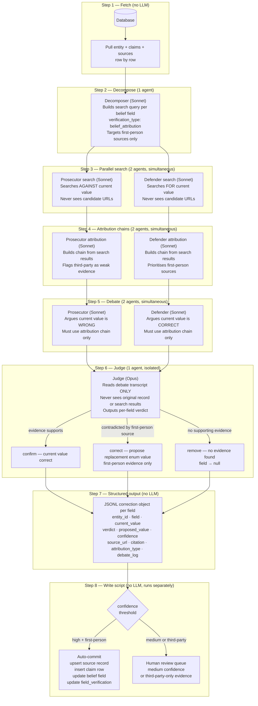

# Mapping AI — Belief Field Adversarial Verification Pipeline

**Purpose:** Focused pipeline for verifying and correcting belief fields (`belief_regulatory_stance`, `belief_agi_timeline`, `belief_ai_risk`, `belief_threat_models`) across all entities using a full adversarial multi-agent architecture.

**Scope:** Belief fields only. Output is actionable corrections — not tags.

**Status:** Ready for implementation

---

## Why adversarial for enum fields

The previous `verify-all.js` pipeline used substring-match quote verification against existing source URLs. This has a structural flaw: it anchors on the database's own sources rather than independently searching for contradicting evidence. A single agent evaluating its own search results has no pressure to surface contradictions — it finds the first plausible source and stops.

The research is unambiguous: adversarial multi-agent debate consistently outperforms single-agent judgment even on constrained tasks (MARCH, DebateCV, PROClaim). Prosecutor/defender forces both sides of the evidence to be represented before the judge sees anything. For belief fields — where a wrong value like `Accelerate` instead of `Moderate` materially misrepresents a person's public position — highest fidelity is worth the cost.

---

## Agent count

**8 LLM calls per belief field per entity.**

| Step | Agent | Model | Role |
|---|---|---|---|
| 2 | Decomposer | Sonnet 4.5 | Builds search query per field; sets verification_type |
| 3a | Prosecutor search | Sonnet 4.5 | Searches for evidence AGAINST current value |
| 3b | Defender search | Sonnet 4.5 | Searches for evidence FOR current value |
| 4a | Prosecutor attribution | Sonnet 4.5 | Builds attribution chain from prosecutor search results |
| 4b | Defender attribution | Sonnet 4.5 | Builds attribution chain from defender search results |
| 5a | Prosecutor | Sonnet 4.5 | Argues current value is wrong; cites contradicting evidence |
| 5b | Defender | Sonnet 4.5 | Argues current value is correct; cites supporting evidence |
| 6 | Judge | Opus 4.5 | Reads debate transcript only; never sees original record |

**Total: 3 distinct models** — Haiku not used here (no staleness check needed for this focused run). All reasoning is Sonnet; judgment is Opus.

**Scale estimate:** 4 belief fields × 8 calls × ~1,887 entities ≈ **60,000 LLM calls total.** Run with concurrency controls.

---

## Pipeline diagram



---

## Step-by-step design

### Step 1 — Fetch (no LLM)

Pull each entity row with its linked claims and sources. Process row by row. For each entity, identify all non-null belief fields to run through the loop.

**Fields in scope:**

| Entity type | Fields |
|---|---|
| Person | `belief_regulatory_stance`, `belief_agi_timeline`, `belief_ai_risk`, `belief_threat_models` |
| Org | `belief_regulatory_stance` only |

Also pull `belief_regulatory_stance_detail` and `belief_evidence_source` — these are updated as side effects when a belief field is corrected.

---

### Step 2 — Decompose (Sonnet 4.5)

Per belief field, the decomposer builds a search query targeting primary sources. All belief fields use `verification_type: "belief_attribution"` — never `"factual"`.

**Search query targeting rules:**
- Op-eds or blog posts written BY the person
- Congressional testimony BY the person (as witness, not questioner)
- Interviews WHERE the person is the interviewee
- Academic papers authored BY the person
- Official organisational position statements

**Deprioritise:** News articles paraphrasing someone's views, podcast summaries written by third parties, Wikipedia, secondary commentary.

---

### Step 3 — Parallel search (2 × Sonnet 4.5)

Two search agents run simultaneously. **Information asymmetry is mandatory:**

- Neither agent sees the candidate URLs from the database
- Neither agent sees the other's search results
- The prosecutor searches specifically for evidence that the current value is wrong
- The defender searches specifically for evidence that the current value is correct

This is the single most important constraint from MARCH (arxiv 2603.24579). The existing `verify-all.js` anchored on its own source URLs. Independent adversarial search produces genuinely new evidence rather than confirming existing citations.

---

### Step 4 — Attribution chains (2 × Sonnet 4.5)

Each search agent's results are passed to an attribution agent that produces a structured chain per statement found. This happens before debate — it forces the "who said this, in what context, is this first-person or third-party" question to be answered before any argument is constructed.

**Attribution chain schema (per statement):**

```json
{
  "source_url": "...",
  "statements": [
    {
      "quote_or_paraphrase": "exact quote or close paraphrase",
      "is_direct_quote": true,
      "speaker": "Person Name",
      "subject": "Person Name",
      "attribution_type": "first_person",
      "supports_current_value": false,
      "contradicts_current_value": true,
      "notes": "From Senate testimony, speaker addressing their own views"
    }
  ]
}
```

**Attribution type hierarchy:**
1. `first_person` — entity speaking or writing about their own views
2. `authored_position` — org's official published position
3. `third_party_characterization` — journalist or analyst describing someone's views

**Critical rules:**
- If a journalist characterises someone's stance: `third_party_characterization`, not `first_person`
- If an interviewer describes the interviewee's views: speaker is interviewer, subject is interviewee — do not attribute described views to the subject
- Org official statements: speaker is the org. Do not attribute to individual employees unless they personally stated it
- In multi-speaker panels, track which speaker said what

---

### Step 5 — Debate (2 × Sonnet 4.5)

Prosecutor and defender run simultaneously. Each receives only their own attribution chain — they never see the other's evidence.

**Prosecutor system prompt constraints:**
- You are arguing that the current DB value for this field is wrong
- You may only cite statements from your attribution chain
- You must flag any statement where `attribution_type` is `third_party_characterization` — note that this is weaker evidence
- You must flag any statement where the speaker is not the entity being verified
- For org belief fields: flag if the only evidence is individual employee statements, not official org positions

**Defender system prompt constraints:**
- You are arguing that the current DB value for this field is correct
- You may only cite statements from your attribution chain
- Prioritise `first_person` statements over `third_party_characterization`
- If you can only find third-party characterisations, state this explicitly — do not overstate the strength of your evidence

---

### Step 6 — Judge (Opus 4.5)

**Critical constraint:** The judge receives only the assembled debate transcript. System prompt explicitly states: *"You have access to the debate transcript only. You have not seen the original record, the search results, or the source URLs."*

This constraint is enforced via system prompt — explicit "you do not have access to X" instructions are more reliable than just withholding data.

**Judge outputs per field:**

| Verdict | Condition | Proposed value |
|---|---|---|
| `confirm` | Evidence supports current value | Same as current |
| `correct` | First-person evidence contradicts current value | Valid enum value from allowed list |
| `remove` | No supporting evidence found | null |

**Hard rules for the judge:**
- `correct` requires at least one `first_person` statement contradicting the current value — third-party characterisations alone are not sufficient
- `proposed_value` must be a valid value from the field's allowed enum list — no free-form values
- Confidence assignment: `high` = multiple first-person sources agree; `medium` = one first-person source or multiple third-party; `low` = only third-party or sources conflict

**Why Opus here and not Sonnet:** The judge receives a debate where both sides have made their strongest case from properly attributed evidence. It needs to weigh conflicting first-person sources, catch when a prosecutor argument relies on third-party characterisation despite the rules, and produce a calibrated verdict. This is the one step where the reasoning complexity justifies Opus.

---

### Step 7 — Structured output (no LLM)

One JSONL record per belief field per entity:

```json
{
  "entity_id": 142,
  "entity_name": "Jane Smith",
  "entity_type": "person",
  "field": "belief_regulatory_stance",
  "current_value": "Accelerate",
  "verdict": "correct",
  "proposed_value": "Moderate",
  "confidence": "high",
  "attribution_type": "first_person",
  "source_url": "https://...",
  "citation": "We need thoughtful guardrails that don't stifle innovation...",
  "reasoning": "Current value Accelerate contradicted by direct Senate testimony...",
  "debate_log": "..."
}
```

This is a diff, not a tag. Every record is actionable.

---

### Step 8 — Write script (no LLM, runs separately)

The pipeline and the write script are deliberately decoupled. The pipeline produces JSONL; the write script commits to the database. This allows review before committing, and selective thresholds.

**Write script logic:**

```
For each correction object in JSONL:
  If confidence == "high" AND attribution_type == "first_person":
    → auto-commit
  Else:
    → human review queue

For auto-commit:
  1. Upsert into source table
       url, title, source_type, date_published, cached_excerpt
  2. Insert/update claim row
       entity_id, belief_dimension, stance, citation, source_id,
       confidence, claim_type, extraction_model, extraction_date
  3. Update entity belief field
       e.g. belief_regulatory_stance = proposed_value
  4. Update belief_evidence_source
       "first_person" → "Explicitly stated"
       "third_party_characterization" → "Inferred"
  5. Update belief_regulatory_stance_detail
       with citation excerpt
  6. Update field_verification JSONB
       { "belief_regulatory_stance": { "status": "verified", "checked_at": "..." } }
```

**Source citation is a deterministic write, not a reasoning task.** The pipeline already produced the `source_url` and `citation` — the write script just formats and inserts them. No LLM needed.

---

## Key design constraints

### Information asymmetry (most important)
Neither search agent sees the candidate URLs from the database. Neither sees the other's results. The judge never sees the original record. These are enforced via system prompt, not just by withholding data.

### First-person requirement for belief corrections
`correct` verdicts on belief fields require first-person attribution. Third-party characterisations support `medium` confidence at most and go to human review, never auto-commit.

### Attribution before debate
The structured attribution chain is built before prosecutor and defender construct their arguments. This prevents selective quoting and forces speaker/subject disambiguation upfront.

### Proposed values must be valid enums
The judge is explicitly instructed that `proposed_value` must be drawn from the field's allowed list. Free-form values are invalid outputs.

### Write script runs separately
The pipeline produces JSONL only. Committing to the database is a separate step, allowing threshold-based review before any data is changed.

---

## Side effects on related fields

When a belief field is corrected, the write script also updates:

| Field updated | Value written |
|---|---|
| `belief_regulatory_stance_detail` | Citation excerpt from winning source |
| `belief_evidence_source` | `Explicitly stated` (first-person) or `Inferred` (third-party) |
| `field_verification` JSONB | `verified` + `checked_at` timestamp |
| `claim.confidence` | `high` / `medium` / `low` from judge |
| `claim.citation` | Verbatim quote from source |
| `source.last_verified_at` | Timestamp of pipeline run |

---

## Research foundations

| Paper | Relevance |
|---|---|
| MARCH (arxiv 2603.24579) | Information asymmetry between search agents; Checker agent deprived of Solver's output |
| DebateCV (arxiv 2507.19090) | Isolated judge context; debate transcript as sole input |
| PROClaim (arxiv 2603.28488) | Prosecutor/defender structure for claim verification |
| Anushree Chaudhuri — internal notes | Attribution chain schema; first-person requirement for belief auto-correction; Stage 3/4 JSON schemas |

---

*Last updated: May 2026*